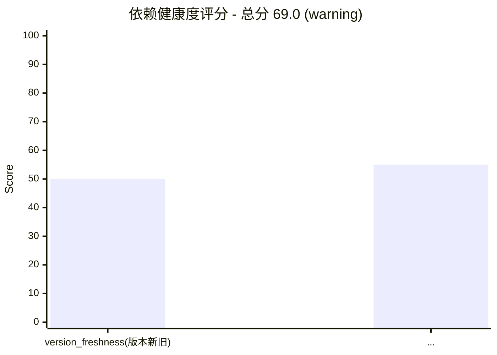

# Dependency Analysis Skill — 依赖分析引擎

> **基于 Ladybug 图数据库的智能依赖关系分析工具**

## TL;DR · 子命令决策树

```
用户意图
├─ 分析某个项目的依赖树/冲突/漏洞   → analyze <project_path>
├─ 查询某个包的详情（版本/依赖/许可证）→ query <pkg> [-e <ecosystem>]
├─ 按关键词搜索包                    → search <keyword> [-e <ecosystem>]
├─ 检查某个包的安全漏洞              → security <pkg>
├─ 从 deps_data.json 生成完整报告    → report <deps_data.json> [--format json|html|pdf|sbom] [-o <file>]
└─ 评估项目依赖健康度（5 维度评分）   → health <project_path> [-o <file>]
```

支持 7 个生态系统：Python(pypi) / Node.js(npm) / Java(maven) / Rust(crates) / Ruby(rubygems) / PHP(packagist) / .NET(nuget)。Go 和 C/C++ 不支持（无中央 registry）。

## Overview

统一的依赖分析技能，基于图数据库实现依赖关系可视化、冲突检测、安全漏洞扫描和版本优化推荐。

## Subcommands

| Subcommand | 说明                   | 使用场景                       |
| ---------- | ---------------------- | ------------------------------ |
| `analyze`  | 分析项目依赖           | 分析项目的依赖树和依赖关系     |
| `query`    | 查询包依赖             | 查询某个包的上下游依赖         |
| `search`   | 搜索包                 | 搜索包信息                     |
| `security` | 检查安全漏洞           | 扫描包的安全漏洞               |
| `report`   | 生成完整报告           | 生成 JSON/HTML/PDF/SBOM 格式的分析报告 |
| `health`   | 依赖健康度评分         | 评估项目依赖健康度（5 维度评分 + 雷达图 + 改进建议） |

---

## Supported Ecosystems

| 生态系统   | 包管理器     | 配置文件             |
| ---------- | ------------ | -------------------- |
| Python     | PyPI / pip   | pyproject.toml, requirements.txt |
| Node.js    | npm / yarn   | package.json         |
| Java       | Maven        | pom.xml              |
| Rust       | Cargo        | Cargo.toml           |
| Ruby       | RubyGems / bundler | Gemfile         |
| PHP        | Composer / Packagist | composer.json  |
| .NET       | NuGet / dotnet CLI  | *.csproj, *.fsproj, *.vbproj |

> Go 和 C/C++ 不在支持列表：Go 无中心 registry（依赖走 git modules，发布走 GitHub Release）；C/C++ 无单一中央仓库（vcpkg/conan 是分散式包管理器）。两者与 dayv「中央包仓库查询」核心定位不匹配。

---

## Quick Start

```bash
# 分析项目依赖（自动检测配置文件类型）
python scripts/dependency_analyzer.py analyze /path/to/project
  # 可选 flag: --conflicts | --recommend | --security | --updates | --report -o <file>

# 查询包的依赖关系（默认 ecosystem=pypi）
python scripts/dependency_analyzer.py query numpy
python scripts/dependency_analyzer.py query react -e npm
python scripts/dependency_analyzer.py query org.springframework.boot:spring-boot -e maven
python scripts/dependency_analyzer.py query serde -e crates
python scripts/dependency_analyzer.py query rails -e rubygems
python scripts/dependency_analyzer.py query monolog/monolog -e packagist
python scripts/dependency_analyzer.py query Newtonsoft.Json -e nuget

# 搜索包
python scripts/dependency_analyzer.py search "web framework"
python scripts/dependency_analyzer.py search "logging" -e npm

# 检查安全漏洞（先查真实最新版本，避免 false positive）
python scripts/dependency_analyzer.py security requests

# 生成完整报告（支持 4 种格式，输入是 deps_data.json 而非项目路径）
python scripts/dependency_analyzer.py report deps_data.json --format json -o report.json
python scripts/dependency_analyzer.py report deps_data.json --format html -o report.html
python scripts/dependency_analyzer.py report deps_data.json --format pdf  -o report.pdf
python scripts/dependency_analyzer.py report deps_data.json --format sbom -o project-sbom.spdx.json
  # deps_data.json schema: {"packages": [{name, version, ecosystem, is_root}], "edges": [{source, target, constraint}]}
  # --format json (默认): 与 export_report_json schema 一致的 JSON 报告
  # --format html: 含可排序表格的 HTML 报告（支持中文，防 XSS）
  # --format pdf:  HTML 转 PDF（依赖 weasyprint，未安装时显式报错）
  # --format sbom: SPDX 2.3 JSON 格式的软件物料清单

# 评估项目依赖健康度（5 维度评分 + 雷达图 + 改进建议）
python scripts/dependency_analyzer.py health /path/to/project
python scripts/dependency_analyzer.py health /path/to/project -o health.json
  # 输出: 总分(0-100) + 5 维度评分 + 改进建议 + Mermaid 雷达图
  # 阈值: >=70 healthy, 50-69 warning, <50 danger
  # 维度: 版本新旧(0.2) / 漏洞状态(0.3) / 维护状态(0.15) / 依赖稳定(0.2) / 许可证合规(0.15)
```

---

## Core Features

### 1. 依赖关系图分析

基于 Ladybug 图数据库构建依赖关系图：
- `Package` 节点：包名、版本、生态系统、描述、许可证等
- `DependsOn` 关系：依赖约束、依赖类型
- `ConflictsWith` 关系：冲突原因、严重级别
- `Vulnerability` 节点：CVE ID、受影响版本、修复版本

### 2. 版本冲突检测

自动检测依赖冲突：
- 版本约束不满足
- 循环依赖
- 版本不兼容

输出冲突信息包括：
- 冲突包名
- 冲突来源（哪些包依赖了冲突版本）
- 冲突类型和严重级别
- 解决建议

### 3. 安全漏洞扫描

基于漏洞数据库检查：
- CVE ID 和严重级别
- 受影响版本范围
- 修复版本
- 漏洞描述和参考链接

### 4. 版本优化推荐

智能推荐最优版本：
- 满足所有版本约束
- 避免已知漏洞
- 尽量使用最新稳定版
- 提供更新路径和迁移步骤

### 5. HTML/PDF 报告输出

`report --format html|pdf` 生成可视化报告：
- **HTML**: 基于 Jinja2 模板，含 5 大章节（项目概览/依赖列表/冲突检测/漏洞检测/版本推荐），表格支持点击表头排序，UTF-8 编码支持中文，自动转义防 XSS
- **PDF**: 由 HTML 经 weasyprint 转换，需安装 `pip install weasyprint`（系统依赖：`apt install libpango-1.0-0 libpangoft2-1.0-0`）；未安装时显式抛 `RuntimeError` 提示安装，不静默失败
- **JSON** (默认): 与 `export_report_json` schema 完全一致，向后兼容
- 复用 `report_renderer.render_report(report_dict, output_path, fmt)` 统一入口

### 6. SBOM 生成 (SPDX 2.3)

`report --format sbom` 生成软件物料清单：
- **标准**: SPDX 2.3 JSON（国际标准，参考 https://spdx.github.io/spdx-spec/）
- **顶层字段**: SPDXVersion / DataLicense(CC0-1.0) / SPDXID / DocumentName / DocumentNamespace(含 UUID 保证唯一) / CreationInfo / Packages / Relationships
- **Package 字段**: Name / SPDXID / VersionInfo / DownloadLocation(按 ecosystem 拼 registry URL) / FilesAnalyzed(false) / LicenseConcluded / Supplier
- **Relationships**: DESCRIBES(文档→根包) + DEPENDS_ON(来自 edges)
- **输出文件**: 默认 `{project_name}-sbom.spdx.json`
- 复用 `sbom_generator.write_sbom(packages, edges, project_name, output_path)`

### 7. 依赖健康度评分

`health <project_path>` 综合评估依赖健康度：
- **总分**: 0-100，加权平均 5 个维度
- **维度与权重**:
  | 维度 | 权重 | 评分逻辑 |
  |------|------|----------|
  | version_freshness 版本新旧度 | 0.20 | `100 * (1 - update_paths/total_packages)` |
  | vulnerability_status 漏洞状态 | 0.30 | `100 - Σ(漏洞扣分)`，critical=40/high=25/medium=20/low=5 |
  | maintenance_status 维护状态 | 0.15 | base=50，有更新活动+25，无漏洞+25 |
  | dependency_stability 依赖稳定性 | 0.20 | `100 - conflicts*25` |
  | license_compliance 许可证合规性 | 0.15 | 默认 75（无 license 数据时中性分） |
- **阈值**: `>=70` healthy / `50-69` warning / `<50` danger
- **输出**: 总分 + 5 维度 ASCII 进度条 + 改进建议（针对最低分维度）+ Mermaid 雷达图
- 复用 `health_scorer.score_health(report_dict)` + `health_scorer.render_radar_mermaid(result)`

---

## Analysis Workflow

```
项目路径
    │
    ▼
1. 检测依赖配置文件 (pyproject.toml / package.json / Cargo.toml / pom.xml)
   输入: project_path (str)   输出: dep_file (Path) + ecosystem (str)
   🔴 CHECKPOINT · 多生态系统并存: 同目录检测到 ≥2 类配置文件 → STOP，列出检测到的生态系统，询问用户扫描范围（全部 / 单个 / 取消）
    │
    ▼
2. 解析依赖列表
   输入: dep_file   输出: packages: List[DependencyNode], edges: List[DependencyEdge]
   失败分支: parser 未实现（pom.xml/Cargo.toml/Gemfile/composer.json/.csproj）→ 提示改用 query -e <ecosystem>
    │
    ▼
3. 构建依赖关系图 (Ladybug GraphDB)
   输入: packages, edges   输出: DependencyGraphDB 实例
   失败分支: GraphDB 初始化失败 → 终止，不降级（见异常处理表）
    │
    ▼
4. 检测冲突
   输入: graph   输出: conflicts: List[ConflictInfo]
   - 版本约束冲突
   - 循环依赖
   🔴 CHECKPOINT · HIGH 冲突: 发现 severity=HIGH 的冲突 → STOP，输出冲突详情，询问是否继续完整扫描（继续 / 跳过冲突只看漏洞 / 取消）
    │
    ▼
5. 安全漏洞扫描
   输入: graph   输出: vulnerabilities: List[SecurityVulnerability]
   失败分支: OSV API 5xx/超时 → 标注"未扫描，不等于无漏洞"，不默认 success
    │
    ▼
6. 版本推荐
   输入: graph, constraints   输出: recommendations: Dict[pkg, version]
   🔴 CHECKPOINT · 升级前验证: 推荐前必须 check_version_constraint 验证目标版本满足所有约束，不假设最新版即可
    │
    ▼
7. 生成报告 (JSON / 可视化)
   输入: 全部分析结果   输出: report.json (schema: summary/conflicts/vulnerabilities/update_paths/recommendations)
```

---

## Output Example

### 冲突检测结果（`detect_conflicts` 输出，`display_conflicts` 格式化）

```
⚠️ Conflict Detected: numpy
  Required by: pandas>=2.0 (numpy>=1.21), scipy>=1.10 (numpy>=1.23)
  Conflict type: version_mismatch   Severity: high
  Suggestion: 统一 numpy 的版本约束
```

### 安全漏洞检测结果（`assess_security` 输出，schema 见 `SecurityVulnerability`）

```
🔴 Vulnerability: requests@2.25.0
  CVE ID: CVE-2023-32681   Severity: HIGH
  Fixed version: 2.31.0
  Description: Unintended leak of Proxy-Authorization header
```

### report.json schema（`export_report_json` 输出）

```json
{
  "timestamp": 1730000000.0,
  "root_package": "my-project",
  "summary": {"total_packages": 12, "total_dependencies": 30, "conflicts": 1, "vulnerabilities": 2, "update_paths": 1},
  "conflicts": [{"package": "numpy", "conflict_type": "version_mismatch", "severity": "high", "required_by": [...], "suggestion": "..."}],
  "vulnerabilities": [{"cve_id": "CVE-2023-32681", "package": "requests", "version": "2.25.0", "severity": "high", "fixed_version": "2.31.0"}],
  "update_paths": [{"package": "requests", "current_version": "2.25.0", "target_version": "2.31.0", "steps": [...]}],
  "recommendations": ["发现 1 个依赖冲突，建议统一版本约束"]
}
```

### health 子命令输出（`health_scorer.score_health` 输出）

```
  总分: 69.0/100  等级: WARNING

  5 维度评分:
    版本新旧度        ██████████░░░░░░░░░░  50.0
    漏洞状态         ███████████░░░░░░░░░  55.0
    维护状态         ███████████████░░░░░  75.0
    依赖稳定性        ████████████████████ 100.0
    许可证合规性       ███████████████░░░░░  75.0

  改进建议:
    1. 版本新旧度最低（50.0），建议升级过时依赖到最新稳定版


```

### SBOM 输出（`sbom_generator.generate_sbom` 输出，SPDX 2.3）

```json
{
  "SPDXVersion": "SPDX-2.3",
  "DataLicense": "CC0-1.0",
  "SPDXID": "SPDXRef-DOCUMENT",
  "DocumentName": "my-project",
  "DocumentNamespace": "https://dayv.local/my-project/<uuid>",
  "CreationInfo": {
    "Created": "2024-01-01T00:00:00Z",
    "Creators": ["Tool: dayv-dependency-analyzer-1.0"],
    "LicenseListVersion": "3.21"
  },
  "Packages": [
    {"Name": "requests", "SPDXID": "SPDXRef-Package-requests", "VersionInfo": "2.25.0",
     "DownloadLocation": "https://pypi.org/project/requests", "FilesAnalyzed": false,
     "LicenseConcluded": "NOASSERTION", "Supplier": "NOASSERTION"}
  ],
  "Relationships": [
    {"SPDXElementID": "SPDXRef-DOCUMENT", "RelationshipType": "DESCRIBES", "RelatedSPDXElement": "SPDXRef-Package-my-project"},
    {"SPDXElementID": "SPDXRef-Package-my-project", "RelationshipType": "DEPENDS_ON", "RelatedSPDXElement": "SPDXRef-Package-requests"}
  ]
}
```

---

## Scripts

| Script                | Purpose                       | 入口函数 | CLI 用法 |
| --------------------- | ----------------------------- | -------- | -------- |
| dependency_analyzer.py| 主分析引擎                    | `main()` | `python dependency_analyzer.py <subcommand> [args]` |
| utils.py              | 版本比较和约束检查工具        | （库模块，不直接运行）| `from utils import check_version_constraint, compare_versions, sort_versions` |
| report_renderer.py    | HTML/PDF/JSON 报告渲染器      | `render_report(report, output, fmt)` | 被 `report --format` 调用 |
| health_scorer.py      | 依赖健康度评分（5 维度）      | `score_health(report_dict)` / `render_radar_mermaid(result)` | 被 `health` 子命令调用 |
| sbom_generator.py     | SPDX 2.3 SBOM 生成器          | `write_sbom(packages, edges, project_name, output)` | 被 `report --format sbom` 调用 |
| pypi.py               | PyPI 包信息获取               | `get_package(name)` / `search_packages(keyword)` | `python pypi.py <package>` 或 `python pypi.py --search <keyword>` |
| npm.py                | npm 包信息获取                | `get_package(name)` / `search_packages(keyword)` | `python npm.py <package>` 或 `python npm.py --search <keyword>` |
| maven.py              | Maven 包信息获取              | `get_package(group:artifact)` | `python maven.py <groupId>:<artifactId>` |
| crates.py             | crates.io 包信息获取          | `get_package(crate)` | `python crates.py <crate-name>` |
| rubygems.py           | RubyGems 包信息获取           | `get_package(gem)` | `python rubygems.py <gem-name>` |
| packagist.py          | Packagist 包信息获取          | `get_package(vendor/package)` | `python packagist.py <vendor/package>` |
| nuget.py              | NuGet 包信息获取              | `get_package(id)` | `python nuget.py <package-id>` |

> 7 个 ecosystem 子脚本输出统一 schema：`{name, description, latest_version, versions[], dependencies{}, download_url, license, homepage}`，便于 `dependency_analyzer.py` 通过 subprocess 调用并解析。

---

## Configuration

```json
{
  "db_path": "/tmp/ladybug_deps.db",
  "vulnerability_db": "https://api.osv.dev/v1",
  "ecosystems": ["pypi", "npm", "maven", "crates", "rubygems", "packagist", "nuget"],
  "output_format": "json",
  "max_cycles_detect": 100,
  "max_recommendations": 20
}
```

| 字段 | 类型 | 默认值 | 作用 |
|------|------|--------|------|
| `db_path` | str | `/tmp/ladybug_deps.db` | Ladybug GraphDB 文件路径，None 时自动创建临时目录 |
| `vulnerability_db` | str | `https://api.osv.dev/v1` | OSV 漏洞数据库 API 端点 |
| `ecosystems` | list | 7 个全量 | 启用的生态系统列表，未列出的 ecosystem 在 `query`/`search` 中会 `sys.exit(1)` |
| `output_format` | str | `json` | 报告输出格式（`json` / `html` / `pdf` / `sbom`，通过 `report --format` 指定） |
| `max_cycles_detect` | int | 100 | 循环依赖检测上限，超出后截断并提示调大 |
| `max_recommendations` | int | 20 | 版本推荐显示上限（`MAX_RECOMMENDATIONS_DISPLAY`） |

---

## Integration

| Integrated Skill | Workflow                                    |
| ---------------- | ------------------------------------------- |
| build            | 依赖分析 → 版本更新 → 构建                   |
| review           | 依赖冲突 → 安全漏洞 → 代码审查                |
| security-expert  | 漏洞扫描 → 安全评估 → 修复建议                |

---

## External Resources

- [OSV Vulnerability Database](https://osv.dev/)
- [PyPI](https://pypi.org/)
- [npm](https://www.npmjs.com/)
- [Maven Central](https://central.sonatype.com/)
- [crates.io](https://crates.io/)
- [RubyGems](https://rubygems.org/)
- [Packagist](https://packagist.org/)
- [NuGet](https://www.nuget.org/)

## Testing & Validation

测试 prompt 集见 `test-prompts.json`（3 个典型场景覆盖 query/security/多语言 analyze）。

单元测试（不入 git）：
- `scripts/tests/test_report_renderer.py` — HTML/PDF/JSON 渲染契约（11 个测试）
- `scripts/tests/test_health_scorer.py` — 5 维度评分逻辑（14 个测试）
- `scripts/tests/test_sbom_generator.py` — SPDX 2.3 schema 完整性（18 个测试）

验证步骤：
1. `python -m py_compile scripts/*.py` — 12 个脚本语法检查（含 3 个新模块）
2. `python scripts/dependency_analyzer.py query numpy` — 验证 PyPI 查询链路
3. `python scripts/dependency_analyzer.py security requests` — 验证漏洞扫描链路
4. `python scripts/dependency_analyzer.py report deps_data.json --format html -o r.html` — 验证 HTML 报告
5. `python scripts/dependency_analyzer.py report deps_data.json --format sbom -o r.spdx.json` — 验证 SBOM
6. `python scripts/dependency_analyzer.py health /path/to/project` — 验证健康度评分
7. `python -m pytest scripts/tests/ tests/ -v` — 跑全部单元测试（79 个）
8. 检查输出是否符合 `Output Example` 章节的 schema

## Dependencies

| 依赖 | 版本 | 用途 | 必需 |
|------|------|------|------|
| real_ladybug | latest | 图数据库（依赖关系存储） | ✅ 必需 |
| httpx | latest | HTTP 客户端（registry 查询） | ✅ 必需 |
| ua-generator | latest | 随机 User-Agent（防封禁） | ✅ 必需 |
| semver | latest | 语义化版本比较 | ✅ 必需 |
| Jinja2 | >=3.0 | HTML 模板渲染 | ✅ 必需（HTML/PDF 报告） |
| weasyprint | >=60 | HTML → PDF 转换 | ⚠️ 可选（仅 PDF 格式需要，未安装时显式报错） |
| tomli / tomllib | latest | TOML 解析（pyproject.toml） | ✅ 必需（Python < 3.11 用 tomli） |

## 异常处理

| 场景 | 触发条件 | 一线修复 | 仍失败兜底 |
|------|---------|---------|-----------|
| 项目无任何已知配置文件 | 7 类配置文件均未检测到 | 列出支持的 7 类文件让用户补充路径 | 终止 analyze，引导改用 `query`/`search` 子命令 |
| 网络不可用导致包信息查询失败 | HTTP 请求超时或 DNS 失败 | 重试 3 次（指数退避，见 `utils.py:MAX_RETRIES`） | 标注"离线模式"，跳过在线漏洞扫描并显式告知 |
| OSV 漏洞数据库无响应 | API 返回 5xx 或超时 | 重试 1 次 | 跳过漏洞扫描并明确告知用户"未扫描，不等于无漏洞" |
| 循环依赖检测超出 `max_cycles_detect` | 检测到的循环数 > 配置上限 | 截断并报告前 N 个循环 | 提示用户调大 `max_cycles_detect` 配置值 |
| Ladybug GraphDB 初始化失败 | DB 文件无写权限或路径错误 | 提示检查 `db_path` 权限 | 终止分析，不降级到无图分析（会丢失冲突检测能力） |
| 包版本不存在于远程 registry | registry 404 | 检查包名拼写 | 标注"本地版本未发布"，不假设版本号 |
| 配置文件解析错误（语法） | TOML/JSON/YAML 解析报错 | 报错位置 + 行号 | 询问用户是否修复，不静默跳过 |
| 多生态系统配置文件并存 | 同目录检测到 ≥2 类配置文件 | 🔴 CHECKPOINT：列出检测到的生态系统，询问扫描范围 | 用户未选择则按全部处理 |
| Maven `pom.xml`/`Cargo.toml` 等命中但无 parser | detect 识别但 parsers 表无对应实现 | 显式提示"自动解析器暂未实现" | 引导改用 `query -e <ecosystem>` 子命令 |
| weasyprint 未安装但请求 PDF 格式 | `report --format pdf` 时 `import weasyprint` 失败 | 显式抛 `RuntimeError` 含安装命令 `pip install weasyprint` | 不降级为 HTML，让用户显式选择 `--format html` |

---

## Anti-patterns / 红灯清单（不要做什么）

> 以下行为会破坏分析正确性或导致 false positive，**严禁**：

### 数据正确性红线

| 红灯 | 后果 | 正确做法 |
|------|------|---------|
| 🚫 用假版本号跑 `security` 子命令 | 误报漏洞（如把已修复版本仍判为受影响） | 必须先调 `pypi.py` 查真实最新版本，查不到则**终止**并告知用户 |
| 🚫 假设最新版本一定满足所有约束 | 推荐版本与现有依赖冲突 | 推荐前必须 `check_version_constraint` 验证所有约束 |
| 🚫 静默吞掉解析错误继续跑 | 报告看似完整实则漏掉依赖 | 解析失败必须报错位置 + 行号，让用户决策 |
| 🚫 把 OSV 无响应当作"无漏洞" | 用户误以为安全 | 必须显式告知"未扫描"，不能默认 success |
| 🚫 假设 `parse_dependencies` 能解析所有 7 类文件 | Maven/Cargo/Gemfile 等会 `sys.exit(1)` | 检测到未实现 parser 时引导用户改用 `query`/`search` |

### 范围红线

| 红灯 | 为什么禁止 |
|------|-----------|
| 🚫 不要为 Go 项目调用本 skill | Go 无中央 registry，依赖走 git modules，与 dayv 核心定位不匹配 |
| 🚫 不要为 C/C++ 项目调用本 skill | vcpkg/conan 是分散式包管理器，无单一查询入口 |
| 🚫 不要扫描 `node_modules`/`venv`/`target` 等构建产物目录 | 会导致依赖图爆炸，重复包节点 |

### 输出红线

| 红灯 | 正确做法 |
|------|---------|
| 🚫 不要把 `0.0.0` 当作真实版本输出给用户 | 解析失败时显式标注"版本未识别"，不输出占位值 |
| 🚫 不要在 `report` 子命令中省略 `vulnerabilities` 字段 | 即使为空也要输出 `[]`，保持 JSON schema 稳定 |
| 🚫 不要用 `print` 替代 `logger` 输出诊断信息 | 用户管道 `python dependency_analyzer.py ... | jq` 会被污染 |

### 并发与限流红线

| 红灯 | 正确做法 |
|------|---------|
| 🚫 不要并发请求同一 registry | `utils.RequestClient` 已内置 `_random_delay`，串行调用 |
| 🚫 收到 429 不要继续打 | 已在 `_request` 中实现指数退避重试 3 次，仍失败则抛 `HTTPError` |