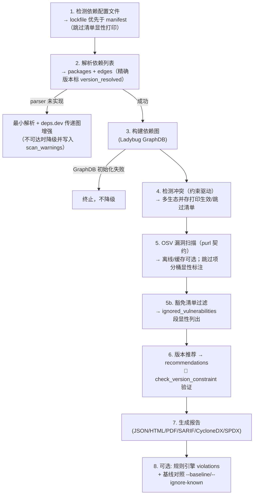

# Dependency Analysis Skill · 大禹 (dayv) — 依赖分析引擎

> 基于 Ladybug 图数据库的智能依赖关系分析工具

## TL;DR · 子命令决策树

```
用户意图
├─ 已有依赖数据 JSON（LLM 整理）   → analyze-data deps_data.json [--conflicts|--security|--report|--rules|--baseline|--exit-code N]
├─ 分析项目依赖树/冲突/漏洞       → analyze <project_path> [--visualize --depth N | --impact | --list-parsers]
├─ 查询包详情                    → query <pkg> [-e <ecosystem>]
├─ 搜索包                        → search <keyword> [-e <ecosystem>]
├─ 检查包安全漏洞                → security <pkg> [--priority] [--exit-code N] [--offline]
├─ 生成完整报告                  → report <deps_data.json> [--format json|html|pdf|sarif|cyclonedx|sbom] [-o <file>]
├─ 评估依赖健康度                → health <project_path> [--allowed-licenses LIST] [--scorecard]
├─ 生成依赖 README 章节          → readme <project_path> [-o <file>]
├─ 模拟升级影响                  → simulate <pkg> <target_ver> [--project <path>]
├─ 漏洞持续监控                  → monitor <project_path> [--cron <expr>] [--webhook <url>] [--offline] [--cache]
└─ 优化依赖配置                  → optimize <project_path> [--check dedupe|redundant|unused] [--deep] [--apply]
```

支持 7 生态系统：Python(pypi) / Node.js(npm) / Java(maven) / Rust(crates) / Ruby(rubygems) / PHP(packagist) / .NET(nuget)。Go 和 C/C++ 不支持（无中央 registry）。

## 主入口 · analyze-data

`analyze-data` 是 LLM 整理 JSON 驱动的事实主入口（对标 osv-scanner 自定义
lockfile JSON 协议：parser 未覆盖的生态由 LLM 整理 deps_data.json 兜底）。
schema：`{"packages":[{name,version,ecosystem,is_root}], "edges":[{source,target,constraint}]}`，
可选扩展字段：`version_resolved`（精确锁定来源）、`group`（依赖组）、
`ignored_vulns`（内联豁免数组）。

```bash
python scripts/dependency_analyzer.py analyze-data deps_data.json --report -o r.json
# CI 门禁：发现漏洞退出 1；输入/解析失败恒为 128
python scripts/dependency_analyzer.py analyze-data deps_data.json --security --exit-code 1
# 声明式规则 + 违规基线（只对新增违规失败）
python scripts/dependency_analyzer.py analyze-data deps_data.json \
  --rules .dayv/rules.json --ignore-known .dayv-known-violations.json --exit-code 1
# 反向消费 syft / osv-scanner 产出的 SBOM
python scripts/dependency_analyzer.py analyze-data --from-sbom sbom.cdx.json --security
```

## Subcommands

| 子命令       | 说明                                   | 关键 flag                                                                                                   |
| ------------ | -------------------------------------- | ----------------------------------------------------------------------------------------------------------- |
| `analyze-data` | 分析依赖数据文件（主入口）             | `--conflicts` / `--security` / `--report` / `--rules` / `--baseline` / `--ignore-known` / `--from-sbom` / `--exit-code N` / `--config` / `--cache` |
| `analyze`    | 分析项目依赖（自动检测 lockfile 优先） | `--visualize`(Mermaid) / `--impact` / `--list-parsers`（解析能力自省）                                       |
| `query`      | 查询包上下游依赖                       | `-e <ecosystem>`                                                                                            |
| `search`     | 按关键词搜索包                         | `-e <ecosystem>`                                                                                            |
| `security`   | 扫描包安全漏洞                         | `--priority` / `--exit-code N` / `--offline` / `--download-offline-db` / `--config` / `--cache`              |
| `report`     | 生成 JSON/HTML/PDF/SARIF/CycloneDX/SPDX 报告 | `--format` / `--allowed-licenses`                                                                    |
| `health`     | 5 维度健康度评分+雷达图                | `--allowed-licenses` / `--license-categories` / `--scorecard`                                                |
| `readme`     | 生成依赖说明 markdown 章节             | -                                                                                                           |
| `simulate`   | 升级影响 dry-run                       | `--project`                                                                                                 |
| `monitor`    | 漏洞定时扫描+告警                      | `--cron` / `--webhook` / `--offline` / `--download-offline-db` / `--cache`                                   |
| `optimize`   | 优化依赖配置（去重+删冗余+识别未使用） | `--check` / `--deep` / `--apply`（实际改文件，自动 .dayv.bak 备份）                                          |

**退出码契约**（CI 门禁）：`0`=成功（含"未发现漏洞"）；`N`=`--exit-code N` 且发现
漏洞（默认 0 保持兼容）；`128`=输入/解析失败（manifest/lockfile/deps_data 缺失
或格式非法）。参照 osv-scanner 固定映射，不用"退出码=违规数"（>255 溢出）。

详细用法、输出 schema、bash 示例见 [`references/subcommands.md`](references/subcommands.md)。

## Supported Ecosystems

| 生态系统 | 包管理器             | manifest 配置文件                 | lockfile（精确版本，优先）                          |
| -------- | -------------------- | --------------------------------- | ---------------------------------------------------- |
| Python   | PyPI / pip           | pyproject.toml, requirements.txt, setup.py | poetry.lock；requirements 精确 pin 标 resolved |
| Node.js  | npm / yarn           | package.json                      | package-lock.json (v2/v3)                            |
| Java     | Maven                | pom.xml（最小解析+deps.dev 增强） | -                                                    |
| Rust     | Cargo                | Cargo.toml（最小解析+deps.dev 增强） | Cargo.lock                                        |
| Ruby     | RubyGems / bundler   | Gemfile（最小解析）               | Gemfile.lock                                         |
| PHP      | Composer / Packagist | composer.json（最小解析）         | composer.lock                                        |
| .NET     | NuGet / dotnet CLI   | \*.csproj, \*.fsproj, \*.vbproj（最小解析） | -                                            |

> Go 和 C/C++ 不支持：Go 无中心 registry（走 git modules），C/C++ 无单一中央仓库（vcpkg/conan 分散式）。
> 命中无完整解析器的 manifest 时自动降级为最小解析 + deps.dev 传递图增强
> （npm/crates/maven/pypi；不可达时降级为直接依赖近似并在 scan_warnings 显性标注）。
> `analyze --list-parsers` 查看各生态解析能力自省表。

## Quick Start

**首跑前置**（缺依赖时脚本会显式报错提示本步骤，不会带着裸 traceback 崩溃）：

```bash
pip install -r requirements.txt
```

```bash
python scripts/dependency_analyzer.py analyze /path/to/project              # 分析依赖树（lockfile 优先）
python scripts/dependency_analyzer.py query numpy                           # 查询包（默认 pypi）
python scripts/dependency_analyzer.py query react -e npm                    # 指定 ecosystem
python scripts/dependency_analyzer.py security requests --priority          # 漏洞+优先级
python scripts/dependency_analyzer.py security requests --exit-code 1       # CI 门禁
python scripts/dependency_analyzer.py report deps_data.json --format html -o report.html
python scripts/dependency_analyzer.py report deps_data.json --format sarif  # GitHub Security 页直连
python scripts/dependency_analyzer.py health /path/to/project --allowed-licenses "MIT,Apache-2.0"
python scripts/dependency_analyzer.py analyze /path/to/project --visualize  # Mermaid 依赖树
python scripts/dependency_analyzer.py readme /path/to/project -o DEPS.md
python scripts/dependency_analyzer.py simulate requests 2.31.0              # 升级模拟
python scripts/dependency_analyzer.py monitor /path/to/project --cron "0 9 * * *"
python scripts/dependency_analyzer.py optimize /path/to/project --deep      # 优化依赖（redundant 查 registry）
python scripts/dependency_analyzer.py optimize /path/to/project --apply     # 实际移除 unused（自动备份）
```

> `report`/`analyze-data` 输入是 `deps_data.json`（非项目路径），schema 见上文主入口章节。

完整 flag 细节与输出示例见 [`references/subcommands.md`](references/subcommands.md)。

## Core Features

与 CLI 实际能力一致（20 项），每项复用独立脚本模块：

1. **依赖关系图分析**（Ladybug GraphDB：Package/DependsOn/ConflictsWith/Vulnerability 节点）
2. **lockfile 解析**（package-lock.json/poetry.lock/Cargo.lock/composer.lock/Gemfile.lock，精确版本消灭范围下界近似）
3. **版本冲突检测**（约束驱动：同包被多个不同约束指向即冲突）
4. **安全漏洞扫描**（OSV querybatch，purl-only 契约；离线库 + TTL 缓存可选）
5. **漏洞豁免清单**（.dayv.toml [[ignored_vulns]]，ignore_until 过期自动恢复告警，alias 连带，报告显性列出）
6. **版本优化推荐**（满足约束 + 避漏洞 + 最新稳定版）
7. **HTML/PDF 报告**（Jinja2 模板，weasyprint 转 PDF，未安装显式报错）
8. **SBOM 双标准输出**（SPDX 2.3 + purl externalRefs；CycloneDX 1.5；可被 osv-scanner/trivy 复扫）
9. **SBOM 反向输入**（analyze-data --from-sbom 消费 syft/osv-scanner 产物）
10. **SARIF 2.1.0 输出**（github/codeql-action/upload-sarif 直连 GitHub Security 页）
11. **依赖健康度评分**（5 维度加权：版本新旧 0.2 / 漏洞 0.3 / 维护 0.15 / 稳定 0.2 / 许可证 0.15；弃用包计入维护扣分。弃用信号：npm 为最新版 deprecated 字符串，crates 为近期版本 yanked 布尔——后者是启发式，历史 yank 的活跃包可能误标）
12. **许可证白名单合规**（--allowed-licenses；内置宽松/弱 Copyleft/Copyleft 分类，YAML/JSON 可覆盖；UNKNOWN 单列）
13. **Mermaid 依赖树可视化**（`--depth N` + 循环检测）
14. **冲突影响范围分析**（BFS 反向追溯 + DFS 路径搜索）
15. **项目依赖 README 生成**（按 ecosystem 分组表格）
16. **升级影响模拟**（风险等级 major=high / minor=medium / patch=low）
17. **漏洞修复优先级排序**（CVSS + exploit + business 加权）
18. **漏洞持续监控**（历史对比 + webhook 告警 + cron）
19. **依赖配置优化**（去重子依赖 + 删冗余传递依赖 + 识别未使用 + --apply 实际改文件）
20. **声明式规则引擎 + 违规基线**（forbidden/allowed/required + severity；--baseline/--ignore-known 违规债务管理）

每个功能的输入/输出 schema、复用函数、实现细节见 [`references/subcommands.md`](references/subcommands.md)。

## Analysis Workflow



注：扫描范围为非交互 CLI——多生态并存时打印生效/跳过清单后继续（不静默缩小范围），
无交互式停问。工作流细节、异常处理表见 [`references/architecture.md`](references/architecture.md)。

## Scripts

| Script                                                                                    | 用途                             | 入口函数                                                 |
| ----------------------------------------------------------------------------------------- | -------------------------------- | -------------------------------------------------------- |
| dependency_analyzer.py                                                                    | 主分析引擎（11 子命令）          | `main()`                                                 |
| utils.py                                                                                  | 版本比较/约束检查/HTTP 客户端    | `check_version_constraint` / `compare_versions`          |
| ecosystem_registry.py                                                                     | 生态元数据单一注册表             | `ECOSYSTEMS` / `parser_status()`                         |
| base_ecosystem.py                                                                          | 7 生态查询子脚本共享基类（fetch→parse 统一 schema） | `BaseEcosystemAdapter`                            |
| purl.py                                                                                   | Package URL 单点生成/解析        | `make_purl()` / `parse_purl()`                           |
| report_renderer.py                                                                        | HTML/PDF/JSON/SARIF 渲染         | `render_report(report, output, fmt)`                     |
| health_scorer.py                                                                          | 健康度评分                       | `score_health()` / `render_radar_mermaid()`              |
| sbom_generator.py                                                                         | SPDX 2.3 + CycloneDX 1.5 SBOM    | `write_sbom()` / `write_cyclonedx()`                     |
| visualizer.py                                                                             | Mermaid 依赖树                   | `render_mermaid_tree(deps_data, depth=3)`                |
| impact_analyzer.py                                                                        | 冲突影响分析                     | `analyze_conflict_impact()` / `format_impact_report()`   |
| readme_generator.py                                                                       | 依赖 README                      | `generate_dependency_readme()`                           |
| simulator.py                                                                              | 升级模拟                         | `simulate_upgrade()` / `format_simulation_report()`      |
| vulnerability_prioritizer.py                                                              | 漏洞优先级                       | `prioritize_vulnerabilities()`                           |
| monitor.py                                                                                | 漏洞监控                         | `run_scan()` / `compare_with_history()` / `send_alert()` |
| dependency_optimizer.py                                                                   | 依赖配置优化                     | `optimize()` / `format_optimize_report()` / `apply_optimization()` |
| exemptions.py                                                                             | 漏洞豁免清单                     | `load_exemptions()` / `apply_exemptions()`               |
| license_policy.py                                                                         | 许可证白名单/分类合规            | `evaluate_license_policy()` / `classify_license()`       |
| osv_offline.py                                                                            | OSV 离线库 + TTL 缓存            | `download_offline_db()` / `offline_query()`              |
| depsdev_client.py                                                                         | deps.dev API 客户端              | `get_dependencies()` / `get_findings()` / `get_scorecard()` |
| rule_engine.py                                                                            | 声明式规则引擎                   | `load_rules()` / `evaluate_rules()`                      |
| violation_baseline.py                                                                     | 已知违规基线                     | `save_baseline()` / `split_known()`                      |
| skill_lint.py                                                                             | skill 仓库工程基线体检（可 vendored） | `lint_repo()`                                       |
| pypi.py / npm.py / maven.py / crates.py / rubygems.py / packagist.py / nuget.py           | 7 ecosystem 包查询               | `get_package(name)`                                      |

> 7 个 ecosystem 子脚本输出统一 schema：`{name, description, latest_version, versions[], dependencies{}, download_url, license, homepage, deprecated?}`
> （deprecated 仅 npm/crates 提供）。生态基址可用 `DAYV_INDEX_URL_<ECO>` 环境变量覆盖（企业私仓）。

## Policy & Config Files

| 文件                             | 用途                                     | 消费方                                    |
| -------------------------------- | ---------------------------------------- | ----------------------------------------- |
| `.dayv.toml`                     | `[[ignored_vulns]]` 豁免（reason/ignore_until） | security / monitor / analyze-data  |
| `.dayv/rules.json`               | 声明式规则                               | analyze-data --rules / rule_engine.py     |
| `.dayv-known-violations.json`    | 已知违规基线                             | analyze-data --baseline / --ignore-known  |
| `lint-checks.json`               | skill 仓自检规则（cli-subcommands 等）   | skill_lint.py                             |

规则场景配方见 [`references/rules-recipes.md`](references/rules-recipes.md)。

## Integration

dayv 当前**未集成任何外部二进制**，全部能力由 `scripts/` 自研实现；也未与其他 skill 建立集成。外部工具（osv-scanner / syft / cyclonedx-cli）的能力对标、集成设计与引入决策见 [`references/external-tools-integration.md`](references/external-tools-integration.md)；产出的 SPDX/CycloneDX/SARIF 均为标准格式，可被 osv-scanner/trivy/GitHub 原生消费。

## External Resources

[OSV](https://osv.dev/) · [PyPI](https://pypi.org/) · [npm](https://www.npmjs.com/) · [Maven Central](https://central.sonatype.com/) · [crates.io](https://crates.io/) · [RubyGems](https://rubygems.org/) · [Packagist](https://packagist.org/) · [NuGet](https://www.nuget.org/) · [deps.dev](https://docs.deps.dev/)

## Testing & Validation

- `python -m py_compile scripts/*.py` — 语法检查（29 个脚本全部通过）
- `python -m pytest tests/ -q` — 回归测试（tests/ 已入 git，clone 后可直接跑）
- `python3 scripts/skill_lint.py .` — 文档一致性门禁（SKILL.md 子命令表 vs CLI --help，lint-checks.json 声明）
- 触发词评估集：`triggers/trigger-queries.json`（20 条查询：10 条 `expect=trigger` 正例 + 10 条 `expect=no` 反例，反例标注归属 skill，如 tiangang/diting/pangu）
- 完整验证步骤见 [`references/architecture.md`](references/architecture.md)

## Anti-patterns

数据正确性、范围、输出、并发限流四类红灯清单见 [`references/anti-patterns.md`](references/anti-patterns.md)。

核心红线：

- 🚫 用假版本号跑 `security`（必须先查真实最新版，查不到则终止）
- 🚫 静默吞解析错误（必须报错位置 + 行号）
- 🚫 OSV 无响应当"无漏洞"（必须显式告知"未扫描"；离线缺库/复杂区间跳过分桶显性标注）
- 🚫 假设最新版满足所有约束（必须 `check_version_constraint`）
- 🚫 豁免静默吞漏洞（ignored_vulnerabilities 必须显性列出理由与过期日）
- 🚫 不要为 Go / C/C++ 项目调用本 skill
- 🚫 不要扫 `node_modules` / `venv` / `target` 等构建产物
