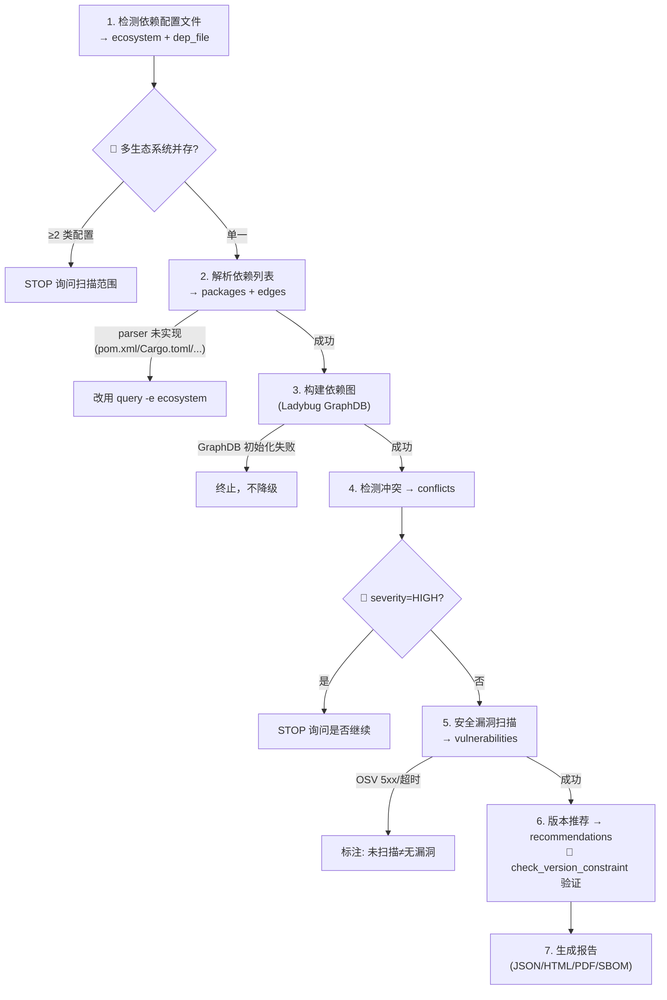

# Dependency Analysis Skill · 大禹 (dayv) — 依赖分析引擎

> 基于 Ladybug 图数据库的智能依赖关系分析工具

## TL;DR · 子命令决策树

```
用户意图
├─ 分析项目依赖树/冲突/漏洞   → analyze <project_path> [--visualize --depth N | --impact]
├─ 查询包详情                 → query <pkg> [-e <ecosystem>]
├─ 搜索包                     → search <keyword> [-e <ecosystem>]
├─ 检查包安全漏洞             → security <pkg> [--priority]
├─ 生成完整报告               → report <deps_data.json> [--format json|html|pdf|sbom] [-o <file>]
├─ 评估依赖健康度             → health <project_path> [-o <file>]
├─ 生成依赖 README 章节       → readme <project_path> [-o <file>]
├─ 模拟升级影响               → simulate <pkg> <target_ver> [--project <path>]
├─ 漏洞持续监控               → monitor <project_path> [--cron <expr>] [--webhook <url>]
└─ 优化依赖配置               → optimize <project_path> [--check dedupe|redundant|unused] [--deep]
```

支持 7 生态系统：Python(pypi) / Node.js(npm) / Java(maven) / Rust(crates) / Ruby(rubygems) / PHP(packagist) / .NET(nuget)。Go 和 C/C++ 不支持（无中央 registry）。

## Subcommands

| 子命令     | 说明                                   | 关键 flag                                       |
| ---------- | -------------------------------------- | ----------------------------------------------- |
| `analyze`  | 分析项目依赖树/关系                    | `--visualize`(Mermaid) / `--impact`(冲突影响)   |
| `query`    | 查询包上下游依赖                       | `-e <ecosystem>`                                |
| `search`   | 按关键词搜索包                         | `-e <ecosystem>`                                |
| `security` | 扫描包安全漏洞                         | `--priority`(CVSS×0.5+exploit×0.3+business×0.2) |
| `report`   | 生成 JSON/HTML/PDF/SBOM 报告           | `--format`                                      |
| `health`   | 5 维度健康度评分+雷达图                | -                                               |
| `readme`   | 生成依赖说明 markdown 章节             | -                                               |
| `simulate` | 升级影响 dry-run                       | `--project`                                     |
| `monitor`  | 漏洞定时扫描+告警                      | `--cron` / `--webhook`                          |
| `optimize` | 优化依赖配置（去重+删冗余+识别未使用） | `--check` / `--deep`                            |

详细用法、输出 schema、bash 示例见 [`references/subcommands.md`](references/subcommands.md)。

## Supported Ecosystems

| 生态系统 | 包管理器             | 配置文件                         |
| -------- | -------------------- | -------------------------------- |
| Python   | PyPI / pip           | pyproject.toml, requirements.txt |
| Node.js  | npm / yarn           | package.json                     |
| Java     | Maven                | pom.xml                          |
| Rust     | Cargo                | Cargo.toml                       |
| Ruby     | RubyGems / bundler   | Gemfile                          |
| PHP      | Composer / Packagist | composer.json                    |
| .NET     | NuGet / dotnet CLI   | _.csproj, _.fsproj, \*.vbproj    |

> Go 和 C/C++ 不支持：Go 无中心 registry（走 git modules），C/C++ 无单一中央仓库（vcpkg/conan 分散式）。

## Quick Start

**首跑前置**（缺依赖时脚本会显式报错提示本步骤，不会带着裸 traceback 崩溃）：

```bash
pip install -r requirements.txt
```

```bash
python scripts/dependency_analyzer.py analyze /path/to/project              # 分析依赖树
python scripts/dependency_analyzer.py query numpy                           # 查询包（默认 pypi）
python scripts/dependency_analyzer.py query react -e npm                    # 指定 ecosystem
python scripts/dependency_analyzer.py security requests --priority          # 漏洞+优先级
python scripts/dependency_analyzer.py report deps_data.json --format html -o report.html
python scripts/dependency_analyzer.py health /path/to/project               # 健康度评分
python scripts/dependency_analyzer.py analyze /path/to/project --visualize  # Mermaid 依赖树
python scripts/dependency_analyzer.py readme /path/to/project -o DEPS.md
python scripts/dependency_analyzer.py simulate requests 2.31.0              # 升级模拟
python scripts/dependency_analyzer.py monitor /path/to/project --cron "0 9 * * *"
python scripts/dependency_analyzer.py optimize /path/to/project              # 优化依赖（去重/删冗余/识别未使用）
python scripts/dependency_analyzer.py optimize /path/to/project --check unused  # 仅检测未使用依赖
python scripts/dependency_analyzer.py optimize /path/to/project --deep          # redundant 查 registry
```

> `report` 输入是 `deps_data.json`（非项目路径）。schema：`{"packages":[{name,version,ecosystem,is_root}], "edges":[{source,target,constraint}]}`

完整 flag 细节与输出示例见 [`references/subcommands.md`](references/subcommands.md)。

## Core Features

11 个核心功能（与 CLI 实际子命令一致），每个复用独立脚本模块：

1. **依赖关系图分析**（Ladybug GraphDB：Package/DependsOn/ConflictsWith/Vulnerability 节点）
2. **版本冲突检测**（约束不满足/循环依赖/版本不兼容）
3. **安全漏洞扫描**（OSV 数据库：CVE/严重度/修复版本）
4. **版本优化推荐**（满足约束 + 避漏洞 + 最新稳定版）
5. **HTML/PDF 报告**（Jinja2 模板，weasyprint 转 PDF，未安装显式报错）
6. **SBOM 生成**（SPDX 2.3 JSON）
7. **依赖健康度评分**（5 维度加权：版本新旧 0.2 / 漏洞 0.3 / 维护 0.15 / 稳定 0.2 / 许可证 0.15）
8. **Mermaid 依赖树可视化**（`--depth N` + 循环检测）
9. **冲突影响范围分析**（BFS 反向追溯 + DFS 路径搜索）
10. **项目依赖 README 生成**（按 ecosystem 分组表格）
11. **升级影响模拟**（风险等级 major=high / minor=medium / patch=low）
12. **漏洞修复优先级排序**（CVSS + exploit + business 加权）
13. **漏洞持续监控**（历史对比 + webhook 告警 + cron）
14. **依赖配置优化**（去重子依赖 + 删冗余传递依赖 + 识别未使用依赖，减小配置文件大小与二进制体积）

每个功能的输入/输出 schema、复用函数、实现细节见 [`references/subcommands.md`](references/subcommands.md)。

## Analysis Workflow



工作流细节、异常处理表见 [`references/architecture.md`](references/architecture.md)。

## Scripts

| Script                                                                          | 用途                             | 入口函数                                                 |
| ------------------------------------------------------------------------------- | -------------------------------- | -------------------------------------------------------- |
| dependency_analyzer.py                                                          | 主分析引擎                       | `main()`                                                 |
| utils.py                                                                        | 版本比较/约束检查/HTTP 客户端    | `check_version_constraint` / `compare_versions`          |
| report_renderer.py                                                              | HTML/PDF/JSON 渲染               | `render_report(report, output, fmt)`                     |
| health_scorer.py                                                                | 健康度评分                       | `score_health()` / `render_radar_mermaid()`              |
| sbom_generator.py                                                               | SPDX 2.3 SBOM                    | `write_sbom(packages, edges, project, output)`           |
| visualizer.py                                                                   | Mermaid 依赖树                   | `render_mermaid_tree(deps_data, depth=3)`                |
| impact_analyzer.py                                                              | 冲突影响分析                     | `analyze_conflict_impact()` / `format_impact_report()`   |
| readme_generator.py                                                             | 依赖 README                      | `generate_dependency_readme()`                           |
| simulator.py                                                                    | 升级模拟                         | `simulate_upgrade()` / `format_simulation_report()`      |
| vulnerability_prioritizer.py                                                    | 漏洞优先级                       | `prioritize_vulnerabilities()`                           |
| monitor.py                                                                      | 漏洞监控                         | `run_scan()` / `compare_with_history()` / `send_alert()` |
| dependency_optimizer.py                                                         | 依赖配置优化（去重/冗余/未使用） | `optimize()` / `format_optimize_report()`                |
| pypi.py / npm.py / maven.py / crates.py / rubygems.py / packagist.py / nuget.py | 7 ecosystem 包查询               | `get_package(name)`                                      |

> 7 个 ecosystem 子脚本输出统一 schema：`{name, description, latest_version, versions[], dependencies{}, download_url, license, homepage}`

完整 Configuration、Dependencies、Testing、异常处理见 [`references/architecture.md`](references/architecture.md)。

## Integration

| Integrated Skill | Workflow                       |
| ---------------- | ------------------------------ |
| build            | 依赖分析 → 版本更新 → 构建     |
| review           | 依赖冲突 → 安全漏洞 → 代码审查 |
| security-expert  | 漏洞扫描 → 安全评估 → 修复建议 |

外部工具（osv-scanner / syft / cyclonedx-cli）的能力对标、集成设计与引入决策见 [`references/external-tools-integration.md`](references/external-tools-integration.md)。dayv 当前**未集成任何外部二进制**，全部能力由 `scripts/` 自研实现。

## External Resources

[OSV](https://osv.dev/) · [PyPI](https://pypi.org/) · [npm](https://www.npmjs.com/) · [Maven Central](https://central.sonatype.com/) · [crates.io](https://crates.io/) · [RubyGems](https://rubygems.org/) · [Packagist](https://packagist.org/) · [NuGet](https://www.nuget.org/)

## Testing & Validation

- `python -m py_compile scripts/*.py` — 语法检查（所有脚本可通过）
- 回归测试目录（`scripts/tests/`）未纳入 git，clone 后不可直接 pytest——验证以各子命令实际运行 + `--help` 输出核对为准
- 完整验证步骤见 [`references/architecture.md`](references/architecture.md)

## Anti-patterns

数据正确性、范围、输出、并发限流四类红灯清单见 [`references/anti-patterns.md`](references/anti-patterns.md)。

核心红线：

- 🚫 用假版本号跑 `security`（必须先查真实最新版，查不到则终止）
- 🚫 静默吞解析错误（必须报错位置 + 行号）
- 🚫 OSV 无响应当"无漏洞"（必须显式告知"未扫描"）
- 🚫 假设最新版满足所有约束（必须 `check_version_constraint`）
- 🚫 不要为 Go / C/C++ 项目调用本 skill
- 🚫 不要扫 `node_modules` / `venv` / `target` 等构建产物
