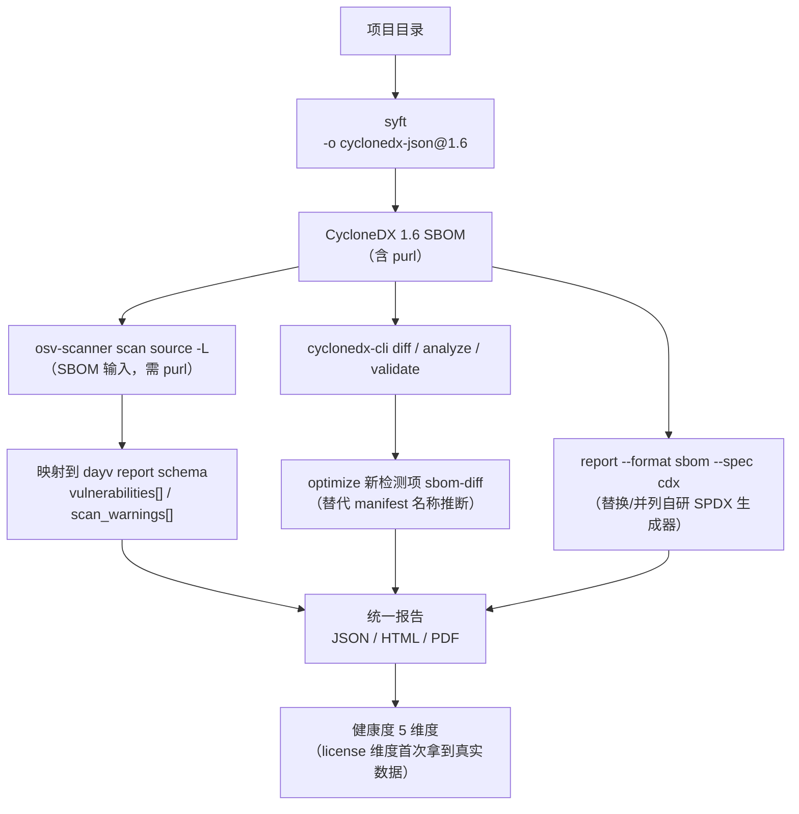
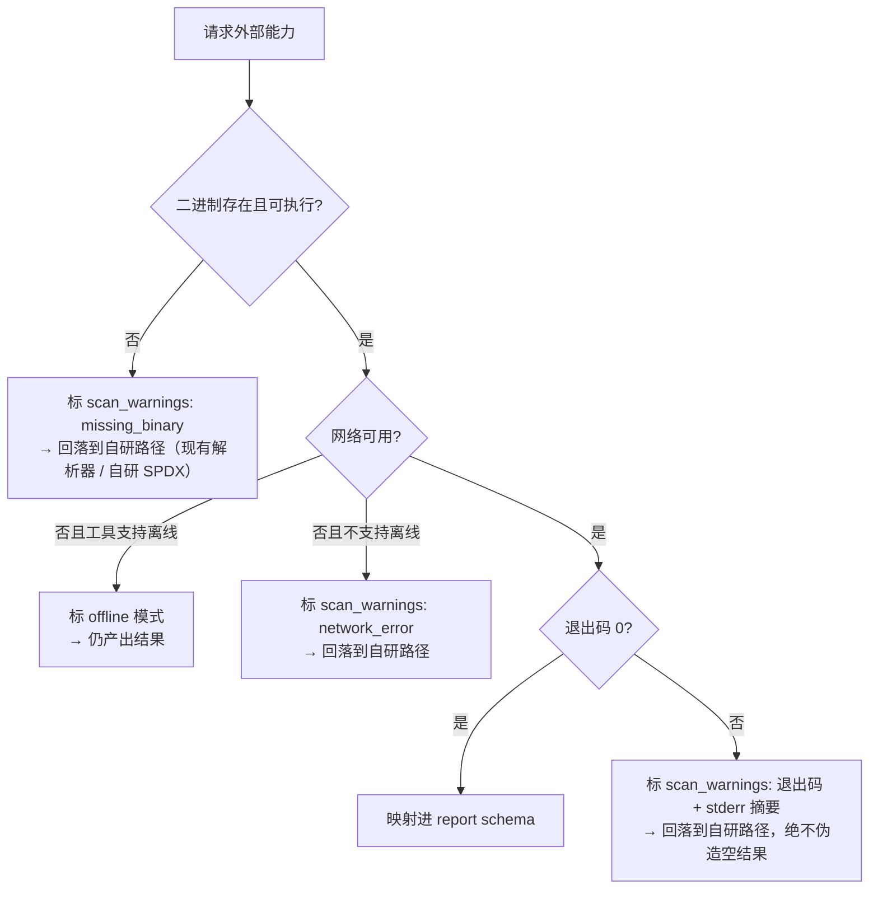
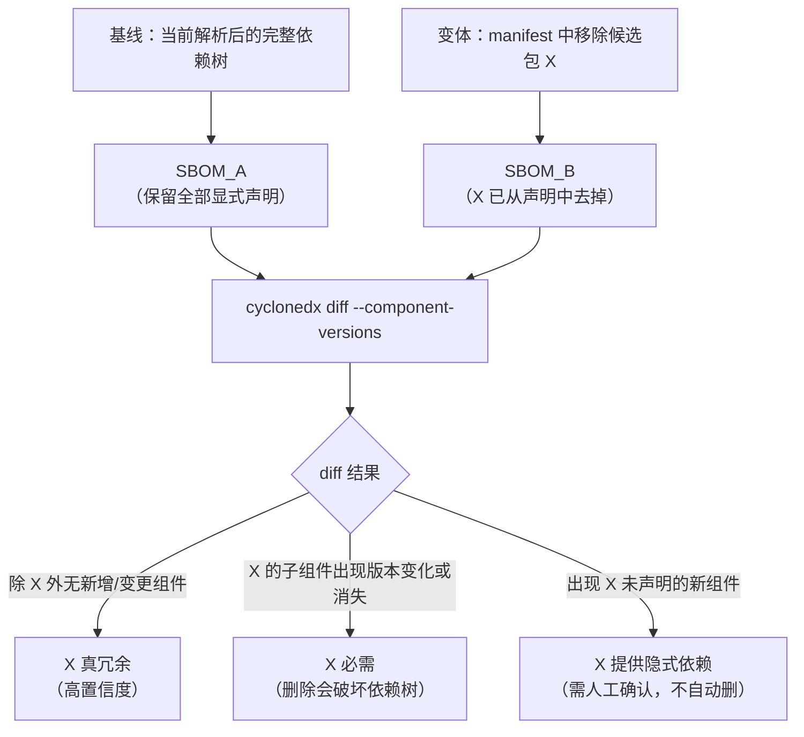

# External Tools Integration Plan

> 上游外部工具（漏洞扫描 / SBOM 生成 / SBOM 运维）的能力对标、集成设计、SBOM diff 语义、工具注册表模式与引入决策清单。
> **当前状态：dayv 未集成任何外部二进制，本文件是可评审方案，不是实施记录。**
> 核实时间：2026-09-30。事实来源：GitHub API（仓库元数据 / releases）+ 各项目 README 与官方文档。

## 0. 一句话结论

dayv 的 **7 生态 registry 查询 + 图分析 + 冲突检测 + unused 检测是自研且有差异化价值**；但 **SBOM 生成、SBOM diff/merge/validate、lockfile 解析、离线漏洞库** 四块是真实缺口，其中三块被成熟工具以宽松许可覆盖。三条建议路线（自研补齐 / 外部工具可选增强 / 混合）需要维护者拍板，见 [§5](#5-依赖引入决策清单待拍板)。

---

## 1. 能力对标

### 1.1 上游真实能力核实

#### google/osv-scanner

| 项 | 核实值 |
| --- | --- |
| Star / License | 11,121 / Apache-2.0 |
| 语言 / 最近 push | Go / 2026-09-29 |
| 最新 release | `v2.6.0`（2026-09-14）；主版本已是 **v2**（v1 归档在 `google/osv-scanner-v1`） |
| 底层库 | `google/osv-scalibr`（v2 把提取与匹配全交给 Scalibr） |

**子命令**：`scan source`（默认）、`scan image`（容器镜像）、`fix`（实验性引导式修复）。

**支持的 lockfile / manifest**（官方 supported-languages-and-lockfiles 页逐条列出）：

| 生态 | Lockfile | Manifest（仅声明，版本是区间） |
| --- | --- | --- |
| C/C++ | `conan.lock` | — （vendored 代码走 commit 级扫描） |
| Dart | `pubspec.lock` | — |
| Elixir | `mix.lock` | — |
| Go | — | `go.mod` |
| Haskell | `cabal.project.freeze`、`stack.yaml.lock` | — |
| Java | `buildscript-gradle.lockfile`、`gradle.lockfile`、`gradle/verification-metadata.xml` | `pom.xml`（默认含传递依赖） |
| JavaScript | `bun.lock`、`package-lock.json`、`pnpm-lock.yaml`、`yarn.lock` | — |
| .NET | `deps.json`、`packages.lock.json` | `packages.config` |
| PHP | `composer.lock` | — |
| Python | `Pipfile.lock`、`poetry.lock`、`pdm.lock`、`pylock.toml`、`uv.lock` | `requirements.txt` |
| R | `renv.lock` | — |
| Ruby | `Gemfile.lock`、`gems.locked` | — |
| Rust | `Cargo.lock` | — |

> 官方明确：manifest 里是版本区间而非实际安装版本，**优先用解析后的 lockfile**。这正是 dayv 当前解析器的软肋（见 [§1.3](#13-dayv-现状真实缺口清单)）。

**输出格式**（`--format`）：`table`（默认）、`markdown`、`vertical`、`html`（另有 `--serve` + `--port`）、`json`、`sarif`、`spdx-2-3`、`cyclonedx-1.4`、`cyclonedx-1.5`。JSON 结果里每条结果的 `source.type` 取值为 `lockfile | sbom | git | docker`。

**SBOM 作为输入**（`scan-source.md` 专章）：按文件名约定自动识别——SPDX：`*.spdx.json`、`*.spdx`、`*.spdx.yml`、`*.spdx.rdf`、`*.spdx.rdf.xml`；CycloneDX：`bom.json`、`*.cdx.json`、`bom.xml`、`*.cdx.xml`。用 `osv-scanner scan source -L <sbom 文件>` 指定单个文件。**前提是 SBOM 里的组件带 Package URL（purl）**。

**离线**：`--offline` 走已缓存的本地库；`--offline-vulnerabilities` + `--download-offline-databases <dir>` 下载离线库到指定目录。下载后不再需要网络。

**其他**：
- 许可证扫描：`--licenses`（数据源 deps.dev），`--licenses="MIT,Apache-2.0"` 可对白名单校验
- 调用分析：`--call-analysis=rust` 等，用于压制"有漏洞函数但项目没调用"的误报
- 引导式修复（实验性）：npm `package-lock.json`（in-place）、npm `package.json`（relock）、Maven `pom.xml`（override）
- 容器扫描：Alpine / Debian / Ubuntu；可提取 APK、dpkg、chiseled、Go 二进制、Cargo Auditable 二进制、Uber JAR、`node_modules`、Python wheel
- 忽略规则：默认遵守 `.gitignore`（`--no-ignore` 覆盖），`osv-scanner.toml` 的 `[[PackageOverrides]]` 可排除包/目录

**出网面**：OSV.dev API、deps.dev API，以及可能的 Maven Central / npm registry / PyPI。

#### anchore/syft

| 项 | 核实值 |
| --- | --- |
| Star / License | 9,626 / Apache-2.0 |
| 语言 / 最近 push | Go / 2026-09-29 |
| 最新 release | `v1.52.0`（2026-09-17） |

**扫描目标**：容器镜像、目录/文件系统、归档包；支持 OCI / Docker / Singularity。

**支持的生态：35 个** — AI、ALPM、APK、Apple、Binary、Bitnami、C/C++、Conda、Dart、DPKG、Elixir、Erlang、GitHub Actions、Go、Haskell、Homebrew、Java、JavaScript、Linux、Lua、.NET、Nix、OCaml、PHP、Prolog、Python、R、RPM、Ruby、Rust、SBOM、Snap、Swift、Terraform、WordPress。

**输出格式**：table、json、purls、github-json、template、text、cyclonedx-json、cyclonedx-xml、spdx-json、spdx-tag-value。

**规范版本**（`-o cyclonedx-json@1.6` 语法指定）：cyclonedx-json 1.2–1.7；cyclonedx-xml 1.0–1.7；spdx-json 2.2 / 2.3 / 3.0；spdx-tag-value 2.1 / 2.2 / 2.3。不指定时取该格式支持的最高版本。

**格式转换**：`syft convert <in> -o <fmt>[=<out>]`，官方标注 **experimental**，并警告非原生格式链路会丢字段。

**其他**：支持 in-toto 规范的签名 SBOM attestation；与 grype（漏洞扫描）配套使用。

> **关键差异**：syft 的探测面是**已安装的文件系统**（`node_modules`、`site-packages`、jar），不是 manifest。dayv 明确禁止扫 `node_modules` / `venv` / `target`，这既是 dayv 的安全边界，也正好是 dayv 结构性缺能力的地方。

#### CycloneDX/cyclonedx-cli

| 项 | 核实值 |
| --- | --- |
| Star / License | 545 / Apache-2.0 |
| 语言 / 最近 push | C#（.NET）/ 2026-09-21 |
| 最新 release | `v0.33.1`（2026-07-23） |

**子命令**：`add files`、`analyze`、`convert`、`diff`、`keygen`、`merge`、`sign`、`validate`、`verify`。

**格式**：CycloneDX XML / JSON / Protobuf / CSV，以及 **SPDX JSON v2.3**。`--output-version` 支持 `v1_0 … v1_7`；`validate --input-version` 默认 v1_7。

**对 dayv 直接相关的三条**：

- `analyze --multiple-component-versions` — 报告"同一组件存在多个版本"。这与 dayv `find_duplicates`（按 name 分组判重）是同一件事的**版本感知、purl 键控**版本。
- `diff <from> <to> --component-versions` — 报告组件版本的新增 / 移除 / 修改。
- `merge`（含 `--hierarchical`）、`validate --fail-on-errors`（适合当 CI 门禁）、`sign`/`verify`（RSA，PKCS1 SHA256）、`keygen`。

**边界**：SPDX ↔ CycloneDX 转换经由 `CycloneDX.Spdx.Interop`，**会丢信息**。转换矩阵里 SPDX 只到 **2.3**，没有 SPDX 3.0。

**部署**：支持 stdin/stdout 管道；官方 Docker 镜像 `cyclonedx/cyclonedx-cli`；Homebrew tap。

#### analysis-tools-dev/static-analysis

| 项 | 核实值 |
| --- | --- |
| Star / License | 14,812 / MIT |
| 语言 / 最近 push | Rust（CI 与渲染器）/ 2026-09-21 |

**数据/代码分离**（README 首行即 `🚨 DON'T EDIT THIS FILE DIRECTLY. Edit files in data/tools/ instead. 🚨`）：

| 路径 | 角色 |
| --- | --- |
| `data/tools/<name>.yml` | 每个工具一条元数据（唯一手写入口） |
| `data/tags.yml` | 受控标签词表：`{name, value, type}`，`type` 至少含 `other` / `language`，可选 `include_multi` |
| `data/collections/<name>.yml` | `{name, homepage, description}` |
| `data/api/` | **生成产物**（JSON API） |
| `ci/crates/{render,pr-check,github-repo}` | Rust 实现：渲染器 + 准入检查器 + GitHub API 封装 |
| `README.md` | **纯生成产物**（190KB） |

**工具条目 schema**（实测 ruff.yml / semgrep.yml）：`name`、`categories`、`tags[]`、`license`、`types[]`、`source`、`homepage`、`description`、`resources[]`（title+url）、`reviews[]`、`demos[]`，另有 `deprecated: true` 标记退役。

**格式硬约束**：name ≤ 50 UTF-8 字节；description ≤ 500 字符；license 必填（闭源写 `proprietary`）；至少 1 个 tag。

**CI 准入门槛**（`CONTRIBUTING.md` + `.github/workflows/pr-check.yml`）：

- 存在 ≥ 6 个月
- GitHub star ≥ 20
- 人类贡献者 > 1 — **机器人不计入**：排除 GitHub bot 账号、`[bot]` 后缀登录名、以及 `claude` / `dependabot` / `renovate-bot` 等已知自动化账号（即使 GitHub 把它当普通用户）
- 校验失败 → bot 关闭 PR；**无法自动核实的（闭源工具、非 GitHub 源）转人工复核而非自动关闭**
- 非 GitHub 源：查 homepage 域名的 RDAP 注册时间，域名 < 6 个月即失败，但转人工复核
- 格式约束违反 → 关闭 PR

**安全姿势**：`pr-check.yml` 用 `pull_request_target`，只 checkout 受信任的 `master`，**从不 checkout 或执行 PR 代码**；只通过 `gh api` 把 PR 新增的 `data/tools/*.y(a)ml` 当作**数据**下载下来喂给从 master 编译出的 `pr-check`。生成物（README.md）被 PR 改动时 CI 直接 FAIL（退出码 2 = 已核实拒绝 → 自动 close PR）。

**渲染闭环**：`make render` → 写 README.md + data/api → `render.yml`（push 到 master 触发）自动 commit → `repository-dispatch` 通知网站重建。

### 1.2 逐项对标：已覆盖 / 真实缺口 / 重复造轮子

| 能力 | dayv 现状（已核实） | 判定 |
| --- | --- | --- |
| 7 生态 registry 元数据查询 | `scripts/{pypi,npm,maven,crates,rubygems,packagist,nuget}.py`，统一 schema | ✅ **自研覆盖，保留** |
| 依赖图 + 冲突检测 + 循环检测 | Ladybug GraphDB，`Package/DependsOn/ConflictsWith/Vulnerability` | ✅ **自研覆盖，外部工具都没有** |
| 冲突影响范围（BFS/DFS） | `impact_analyzer.py` | ✅ **自研独有** |
| 升级影响模拟 | `simulator.py` | ✅ **自研独有** |
| unused 依赖检测（声明但代码未引用） | `dependency_optimizer.find_unused` + `ECOSYSTEM_SCAN` 正则扫描 | ✅ **自研独有**（osv-scanner / syft 都不做，需调用图） |
| 漏洞优先级业务排序 | `vulnerability_prioritizer`（CVSS×0.5 + exploit×0.3 + business×0.2） | ✅ **自研覆盖，保留** |
| 漏洞历史对比 + webhook 告警 | `monitor.py` | ✅ **自研覆盖，保留** |
| **manifest 解析** | **只实现 3 个**：`pyproject.toml` / `package.json` / `requirements.txt` | 🔴 **真实缺口**。osv-scanner 覆盖 19+ lockfile 类型、12 生态；`detect_dependency_file` 能认出 `pom.xml`/`Cargo.toml`/`Gemfile`/`composer.json`/`.csproj` 但 `parse_dependencies` 直接 `sys.exit(1)` |
| **lockfile 解析（精确版本）** | **完全没有** | 🔴 **真实缺口**。`parse_package_json` 用 `lstrip("^~>=<")` 把区间当版本；`parse_pyproject_toml` 只取首个 `>=` 界、缺省填 `"0.0.0"`。这些"伪版本"随后被送进 OSV querybatch → 系统性误报/漏报（与 SKILL.md 自己写的红线"用假版本跑 security"矛盾） |
| **离线漏洞扫描** | 无 | 🔴 **真实缺口**。osv-scanner 有 `--offline` + 离线数据库下载 |
| **许可证扫描（对白名单）** | 无 | 🔴 **真实缺口**。osv-scanner `--licenses="MIT,Apache-2.0"` |
| **文件系统级组件探测** | 无（SKILL.md 明确禁止扫 `node_modules`/`venv`/`target`） | 🟡 **范围边界**。syft 35 生态的核心能力，dayv 主动不做——需确认是刻意的还是顺手的 |
| **SBOM 生成（通用）** | 自研 `sbom_generator.py`，仅 SPDX 2.3 JSON | 🔴 **重复造轮子**。syft 35 生态、10 种输出格式、含文件系统级探测；cyclonedx-cli 可跨格式转换 |
| **SBOM 输出多格式 / 多版本** | 仅 SPDX 2.3 | 🔴 **重复造轮子**。syft 支持 CycloneDX 1.2–1.7 / SPDX 2.2/2.3/3.0 / tag-value / purls |
| **SBOM diff / merge / convert / validate / sign** | 完全没有 | 🔴 **真实缺口，且正是 cyclonedx-cli 的全部核心** |
| **SBOM ↔ 漏洞结果合流** | 两条链路互不相通 | 🔴 **真实缺口**。osv-scanner 可直接 `-L sbom.cdx.json`；dayv 的 SPDX 生成器**不输出 purl**，因此连这条路都走不通 |
| **SBOM 校验 / 签名 / CI 门禁** | 无 | 🔴 **真实缺口**。`cyclonedx validate --fail-on-errors` / `sign` / `verify` |
| **dedupe（重复声明）** | 自研 `find_duplicates`（按 name 分组，**版本不敏感**） | 🔴 **重复造轮子**。`cyclonedx analyze --multiple-component-versions` 是版本感知的标准版 |
| **工具元数据集中登记** | 13 处硬编码（见 [§4.1](#41-现状13-处硬编码)） | 🔴 **真实缺口**。static-analysis 的 data/ 代码分离直接对应这个问题 |

### 1.3 dayv 现状：真实缺口清单

按修复价值排序。前 3 项是**当前代码里的静默缺陷**，不引入任何外部工具也应该修。

| # | 缺口 | 证据 | 影响 | 修法（是否需外部工具） |
| --- | --- | --- | --- | --- |
| G1 | **健康度「许可证合规」维度恒为常数 75.0** | `health_scorer.py:144-145` 读 `report.get("license_info")`，无值即 `return 75.0`；而 `DependencyAnalyzer.report_to_dict()`（`dependency_analyzer.py:1119-1166`）**从不产出 `license_info`** | 5 维度里权重 0.15 的维度是**占位符不是测量**；且 `for lic in license_info` 期望 list[str]，无调用方提供 | 纯自研：把 registry 已查到的 `license` 透传进 `report_dict` |
| G2 | **SBOM 的 `LicenseConcluded` 永远是 `NOASSERTION`** | `sbom_generator.py:113,128` 读 `pkg.get("license")`；而 `_to_deps_data()`（`dependency_analyzer.py:1710-1736`）**不产出 `license` 键** | 产出的 SBOM 丢失全部许可证信息，喂给下游工具（含 osv-scanner 的 `--licenses`）等于无效 | 纯自研：`_to_deps_data` 补 `license` |
| G3 | **用区间/默认值当版本号送进 OSV** | `parse_package_json` `lstrip("^~>=<")`；`parse_pyproject_toml` 缺省 `"0.0.0"` | 漏洞判定系统性失真；`deps_data.json` 由 LLM 手工整理时同样可能带伪版本 | 纯自研（加版本解析与"无法确定"显式标注）或交给 lockfile |
| G4 | **7 生态只有 3 个 manifest parser** | `parse_dependencies` 的 `parsers` 字典只有 3 项 | `analyze`/`health`/`readme`/`simulate`/`monitor`/`optimize` **6 个子命令**对 maven/crates/rubygems/packagist/nuget 全部不可用，只能退回 `query` | 需外部工具（osv-scanner 19+ lockfile）或自研 4 个 parser |
| G5 | **无 lockfile 解析** | 全部代码无 lockfile 相关实现 | 无法拿到"实际安装版本"，也就无法做可靠的 SBOM / 漏洞判定 | 需外部工具 |
| G6 | **SBOM 单格式单版本，且无 purl** | `sbom_generator.py` 固定 `SPDX-2.3`，`pkg_entry` 无 `externalRefs`/purl | 无法被 osv-scanner 当 SBOM 输入；无法参与 SBOM diff | 需外部工具或补 purl |
| G7 | **无 SBOM diff / merge / convert / validate / sign** | 无对应脚本 | 无法回答"删掉这个依赖到底会带进什么"这类问题 | 需外部工具（cyclonedx-cli） |
| G8 | **无离线漏洞扫描** | `architecture.md` 异常处理表只有"网络不可用 → 标注离线模式" | 离线/内网场景漏洞维度直接不可用 | 需外部工具（osv-scanner 离线库） |
| G9 | **无许可证白名单校验** | 无 | 合规场景需人工 | 需外部工具或自研 |
| G10 | **生态元数据 13 处硬编码** | 见 [§4.1](#41-现状13-处硬编码) | 加一个生态要改 13 个点 | 纯自研重构（registry 化） |

---

## 2. 集成方案（设计建议，未实施）

### 2.1 落点原则

1. **不改动现有子命令的默认行为**。外部工具一律走显式 opt-in（新增 flag 或新子命令），默认路径行为逐字节不变。
2. **沿用现有模块形态**。dayv 已有 `sbom_generator.py` / `health_scorer.py` / `visualizer.py` 这类"纯模块 + 一个入口函数 + `dependency_analyzer.py` 调"的模式，适配层照抄这个形态，不引入新框架。
3. **外部工具的输出必须映射到现有 report schema**，而不是把外部 JSON 直接透传到用户面前——否则下游 HTML/PDF/健康度/优先级的加工全部要重写。
4. **失败必须显性化**（与 SKILL.md 现有红线一致）：外部工具不可用时，报告要写"本节未扫描"而不是留空、更不能默认通过。

### 2.2 建议的接口形状

三个薄适配器 + 一个统一注册表读取器。**以下为签名建议，不含实现。**

| 建议模块 | 建议入口函数 | 输入 | 输出 |
| --- | --- | --- | --- |
| `scripts/ext_osv_scanner.py` | `scan(target, fmt="json", offline=False, licenses=None, config_path=None) -> (payload, meta)` | 项目目录 / lockfile / SBOM 路径 | osv-scanner 原始 JSON + `{binary_version, exit_code, offline, duration_ms}` |
| `scripts/ext_syft.py` | `build_sbom(target, output_format="cyclonedx-json@1.6", output_path=None) -> path` | 目录 / 镜像 / 归档 | SBOM 文件路径 |
| `scripts/ext_cyclonedx.py` | `convert(in, out, version) / diff(a, b) / merge(paths) / validate(path) -> payload` | SBOM 文件 | 各命令的 JSON 结果 |
| `scripts/ext_registry.py` | `load(kind="scanners") -> list[dict]` | — | 从注册表数据文件读出的工具元数据 |

每个适配器内部统一走「探测 → 执行 → 解析 → 映射 → 标注状态」五步，其中「标注状态」是硬性要求：返回的 `meta` 必须能表达 `ok / missing_binary / timeout / network_error / unsupported / skipped`，由上层写进报告的 `scan_warnings`（现有字段）。

### 2.3 外部工具输出映射到统一报告的哪一节

| 外部能力 | 落到报告的哪一节 | 映射要点 | 备注 |
| --- | --- | --- | --- |
| `osv-scanner --format json` | `vulnerabilities[]` | osv 结果里 `results[].packages[].vulnerabilities[]` → 现有 `SecurityVulnerability`（`cve_id/package/version/severity/fixed_version/cvss_vector/cvss_score` 字段已够用） | 额外可带出 `affected_range`、GHSA id、`source.type`，需扩 `SecurityVulnerability` |
| `osv-scanner --licenses` | **新增 `licenses` 节** | 直接补上 G1 + G2 两个死路径：许可证数据 → SBOM 的 `licenses[]` + 健康度 `license_compliance` 维度 | 收益最大的一处接入 |
| `osv-scanner --format cyclonedx-1.5 --all-packages` | `report --format sbom` 的新分支 | 建议 `--format sbom --spec cdx-1.5`；与现有 SPDX 2.3 并列而非替换 | 注意 osv-scanner 的 CycloneDX 输出**不含漏洞信息**（其官方文档明说 SPDX 输出同理，只有包列表） |
| `syft -o cyclonedx-json@1.6` | `report --format sbom --spec cdx-1.6` | 目录/镜像级 SBOM，含 purl | 唯一能出 SPDX 3.0 / tag-value / purls 的路径 |
| `cyclonedx diff --component-versions` | `optimize --check sbom-diff`（新检测项） | 替换当前基于 manifest 名称的 dedupe 推断 | 见 [§3](#3-sbom-diff-语义) |
| `cyclonedx analyze --multiple-component-versions` | `optimize --check dedupe` 的**高置信度数据源** | 版本感知的重复组件检测 | 直接顶替 `find_duplicates` 的位置 |
| `cyclonedx validate --fail-on-errors` | 新增 CI 门禁建议（不落到报告节） | 退出码即可做门禁 | 适合 `pangu` 风格的 pre-commit / CI 步骤 |
| `cyclonedx merge` | 多项目/多语言统一 BOM | 多生态并存场景（当前 dayv 是"只分析第一个文件 + 打印跳过清单"） | 可解 G4 的多生态共存痛点 |

### 2.4 建议的调用链



### 2.5 离线 / 网络约束

现状：dayv 的 7 个 ecosystem 脚本全部走 HTTP；`utils.RequestClient` 提供重试 + 随机 UA；`architecture.md` 的异常处理表规定网络失败 → 标注"离线模式"并显式告知。

引入外部工具后新增的出网面（**这是最大的非功能性变化**）：

| 工具 | 新增出网面 | 离线时行为 |
| --- | --- | --- |
| osv-scanner | OSV.dev API（dayv 已在用）、**deps.dev API（新增）**、**Maven Central / npm registry / PyPI（新增）** | `--offline` + 预下载离线库可完全断网；否则无网络即无结果 |
| syft | 无（纯本地文件系统/镜像分析） | 完全离线可用 |
| cyclonedx-cli | 无（纯本地 BOM 运算） | 完全离线可用 |

**回退阶梯**（每级都必须显式标注，不允许静默降级）：



对应到 SKILL.md 现有红线的写法：**"OSV 无响应当'无漏洞'"这条要扩展成"任一外部能力不可用都必须显式标注'未扫描'"**。

### 2.6 建议的最小可行接入顺序（供拍板）

1. **零外部依赖**：修 G1 + G2 + G3（都是自研内部数据流断点，见 [§1.3](#13-dayv-现状真实缺口清单)）
2. **零外部依赖**：G10 registry 化（见 [§4](#4-工具注册表模式)）
3. **单个外部工具**：cyclonedx-cli（纯本地、无新增出网、.NET 运行时依赖是唯一成本）→ 解 G6/G7
4. **单个外部工具**：syft → 解 SBOM 通用能力 + purl
5. **单个外部工具**：osv-scanner → 解 G4/G5/G8/G9

---

## 3. SBOM diff 语义

### 3.1 替代逻辑

当前 `optimize` 的 `redundant` 检测有两档：

- **quick 模式**：只看 `edges`，若 `source`（非根）→ `target` 都是显式声明包就判 target 冗余。`edges` 来自 manifest 解析，而 manifest 只含**直接声明**，传递依赖根本不在 `edges` 里 → quick 模式实际上几乎永远判不出真冗余。
- **deep 模式**：查 registry 拿每个显式包的 `dependencies`，若 Q 的依赖里含另一个显式声明包 P，就判 P 冗余。这是"声明层面"的判断，**无法回答"删掉 P 之后实际装出来的依赖树会变成什么样"**——但这正是用户真正想知道的问题（可解析模块、peer 依赖、可选依赖、原生扩展、平台特定依赖都会让结果偏离声明图）。

**SBOM diff 的替代逻辑**：



关键差别：判断依据从**声明图**换成**解析后的实际组件集合**（purl 键控、版本感知），这只有在能跑 lockfile / 已安装树的前提下才成立。

**dedupe 的强化**：`cyclonedx analyze --multiple-component-versions` 直接回答"哪些组件同时存在多个版本"。当前 `find_duplicates` 只按 `name` 分组，同名不同版本会同时命中"重复"和"冲突"两个检测项，且无法区分"同名同版本被声明两次"与"同名不同版本共存"。

### 3.2 CycloneDX 1.6 对齐的必要性

先说核实到的**版本现实**（这会改变"要不要锁 1.6"的答案）：

| 工具 | CycloneDX 输出支持 |
| --- | --- |
| syft | 1.2 / 1.3 / 1.4 / 1.5 / **1.6** / **1.7**（JSON）；XML 1.0–1.7 |
| cyclonedx-cli | `v1_0 … v1_7` |
| osv-scanner | 仅 **1.4 / 1.5** |

所以 **1.6 不是当前最高版本（1.7 已出），而 osv-scanner 的输出仍停在 1.5**。这意味着 1.6 是"三方都有交集的稳妥下限"而不是天花板。若锁 1.7，osv-scanner 产出的组件数据就无法直接回流；若锁 1.5，则放弃 1.6 引入的结构化增强。**这条需要用户选**（见 [§5](#5-依赖引入决策清单待拍板)）。

对齐 1.6（或 1.5+）的**功能性**理由：

1. **purl 是硬前提，不是可选项**。osv-scanner 扫描 SBOM 输入时明确要求组件带 Package URL。dayv 现有 `sbom_generator` 的 `pkg_entry` 完全没有 `externalRefs`/purl → 即便接上 osv-scanner 也走不通这一条链。purl 同时也是跨工具（syft ↔ cyclonedx-cli ↔ osv-scanner）保持组件身份一致的唯一公共键。
2. **diff/merge 需要稳定身份键**。`bom-ref` 的唯一性与稳定性是组件级 diff 的前提；不同生成器（dayv / syft）产出的 bom-ref 策略不同，混用工具做 diff 必须先统一这一层。
3. **依赖图表达**。CycloneDX 的 `dependencies[]`（ref → dependsOn refs 数组）是 diff "传递可达性"的基础；dayv 现在把 edges 转成 SPDX `Relationships` 的 `DEPENDS_ON`，语义等价但跨格式转换（cyclonedx-cli 的 SPDX interop）会丢细节。
4. **漏洞可内嵌**。CycloneDX ≥1.4 起有 `vulnerabilities[]`，1.6 进一步加了 `analysis.state` / `justification` / `response` 字段，能把 osv-scanner 的结果直接写回同一份文档，而不是外挂一个 side 文件。dayv 现在是"报告里有漏洞 + 另一个独立 SBOM 文件"，两者无法互相印证。
5. **许可证要改成数组**。CycloneDX 的 `components[].licenses[]` 支持 `{license: {id|name, ...}}` 或 `{expression: ...}`，能表达复合表达式与多许可证；dayv 现在只有单个字符串 `LicenseConcluded`，且**恒为 `NOASSERTION`**（G2）。
6. **生成器元数据要隔离**。`metadata.tools` 记录"谁生成的"。diff 两份分别由 dayv 和 syft 产出的 BOM 时，工具元数据的差异不能被误报成组件变更。
7. **SPDX 侧不是出路**。syft 能出 SPDX 3.0，但 cyclonedx-cli 的转换矩阵只到 SPDX 2.3，SPDX 3.0 **不在 SBOM diff 链路上**。

**版本选择建议（供拍板）**：内部统一产 **CycloneDX 1.6**（三方交集内最新、含 vulnerabilities analysis 与更完整的 licenses 表达），对外喂 osv-scanner 时用同一份 1.6 文件作**输入**（输入侧按文件名 + purl 识别，官方未对输入版本设限），osv-scanner 自身的 CycloneDX **输出**（1.5）仅作漏洞中间件，不作为归档 SBOM。

---

## 4. 工具注册表模式

### 4.1 现状：13 处硬编码

dayv 没有任何工具/生态元数据登记处，生态信息散落在 5 个文件的 13 个位置：

| # | 位置 | 内容 |
| --- | --- | --- |
| 1 | `dependency_analyzer.py:74-82` | `OSV_ECOSYSTEM_MAP`（内部名 → OSV 生态名） |
| 2 | `dependency_analyzer.py:1198-1216` | `dependency_files` + `dependency_extensions`（文件名 → 生态） |
| 3 | `dependency_analyzer.py:1494-1498` | `parsers` 字典（文件名 → 解析器） |
| 4 | `dependency_analyzer.py:1502-1509` | `detect_supported_but_unparsed` |
| 5 | `dependency_analyzer.py:1876-1884` | `cmd_query` 的 `scripts` 字典 |
| 6 | `dependency_analyzer.py:1914-1922` | `cmd_search` 的 `scripts` 字典 |
| 7 | `dependency_analyzer.py:2477 / 2488 / 2499` | argparse `choices` ×3（query/search/security） |
| 8 | `sbom_generator.py:29-37` | `ECOSYSTEM_REGISTRY`（下载 URL 前缀） |
| 9 | `dependency_optimizer.py:22-78` | `ECOSYSTEM_SCAN`（import 正则 + 扩展名 + 归一化） |
| 10 | `dependency_optimizer.py:98-134` | `DEV_TOOLS` 白名单 |
| 11 | `dependency_optimizer.py:467-470` | `_locate_config_file` 的 candidates |
| 12 | `simulator.py:43` + `simulator.py:54` | 回滚提示表 + `scripts` 字典 |
| 13 | `readme_generator.py:38` | 生态 → (显示名, 脚本名) |

加一个生态要改 13 个点、加一个外部工具没有任何登记处——这正是 static-analysis 的 data/ 代码分离要解决的问题。

### 4.2 借鉴点（自写文案，只学机制）

| static-analysis 的做法 | dayv 的对应落法 |
| --- | --- |
| `data/tools/<name>.yml` 是唯一手写入口，README 顶部写"禁止直接编辑" | `registry/scanners.yml` + `registry/ecosystems.yml` 是唯一元数据源；注册表目录内另附生成物声明（禁止手改渲染产物）与贡献指南 |
| 词表受控（`data/tags.yml`：`{name, value, type}`） | `registry/tags.yml` 收口 `capabilities[]` / `types[]` / `ecosystems[]` 三个封闭词表 |
| `make render` 从 YAML 渲染 README + JSON API，`render.yml` push 后自动 commit | 渲染脚本输出 `SKILL.md` 的"Supported Ecosystems / External Resources"表与 `registry/api.json`；CI 对生成物 diff 报 FAIL |
| 准入门槛：≥6 个月 / ≥20 star / >1 人类贡献者（排除 `[bot]` 与 `claude`/`dependabot`/`renovate-bot`） | 直接沿用，作为外部工具的**最低门槛** |
| 校验失败自动关 PR；无法自动核实的转人工复核 | dayv 无 PR 机器人，改为**注册时人工核对 + 在 `scanners.yml` 里记录核对日期与核对人** |
| 格式硬约束（name ≤50 字节、description ≤500 字符、license 必填） | 沿用，加一条"必须有可执行的 `--version` 且能被程序解析" |
| 退役机制：条目加 `deprecated: true` + 客观理由 | 沿用；dayv 额外加 `last_verified` 字段，过期条目在 SKILL.md 渲染时打"建议复核"标记 |
| AGENTS.md 写明 AI 代理贡献前必读的门槛 | dayv 侧同构：注册表目录下放一份贡献指南，写清门槛与自检清单 |

### 4.3 `scanners.yml` 建议 schema

**只放元数据，不放可执行逻辑**（可执行逻辑仍在 `scripts/`），这样注册表可以被人和 CI 安全地读。

```yaml
# registry/scanners.yml —— 外部工具登记表（示例条目，非事实声明）
- id: osv-scanner
  name: OSV-Scanner
  source: https://github.com/google/osv-scanner
  homepage: https://google.github.io/osv-scanner/
  license: Apache-2.0
  types: [binary]              # binary | python | builtin
  capabilities: [vuln, license, sbom-out, offline, container]
  ecosystems: [pypi, npm, maven, crates, rubygems, packagist, nuget, go, dart, elixir, haskell, c, r, csharp]
  entrypoint: osv-scanner
  version_check: [osv-scanner, --version]
  network:
    required: true
    offline_capable: true
    extra_endpoints: [https://api.deps.dev, https://repo.maven.apache.org, https://registry.npmjs.org, https://pypi.org]
  status:
    latest_release: v2.6.0
    latest_release_date: 2026-09-14
    last_verified: 2026-09-30
    verified_by: <维护者>
  admission:
    months_old: 6
    min_stars: 20
    min_human_contributors: 2
    license_allowlist: [MIT, Apache-2.0, BSD-3-Clause, ISC]
  # 退出码语义（实测确认后才可写）
  exit_codes:
    0: no_vulnerability_found
    1: vulnerability_found
  # 未实测的字段留空，不填猜测值（规则 11）
```

配套 `registry/ecosystems.yml` 承接 §4.1 的 13 处：每个生态一条，统一提供 `{id, display_name, osv_name, registry_url, dep_files[], lock_files[], parser, query_script, osv_map, import_scan, dev_tools, apply_targets[]}`，供 §4.1 表中 13 个消费点统一改为读它。

> **注意**：以上 yaml 是**schema 提案**。`latest_release` 等值来自本文 §1.1 的核实，`exit_codes` 等未实测字段必须留空直到实测——不写"看起来对"的值。

---

## 5. 依赖引入决策清单（待拍板）

以下 6 项**不自行决定**，需要维护者明确后再进入实施。

| # | 待决问题 | 选项 | 影响面 |
| --- | --- | --- | --- |
| **Q1** | **是否允许 dayv 在运行时依赖外部二进制？** | (a) 完全不允许，保持"纯 Python + pip 依赖"的零外部依赖定位；(b) 允许，但默认关闭、显式 flag 才启用；(c) 允许并作为推荐路径 | (a) 封死 G4/G5/G6/G7/G8/G9；(b)/(c) 需承担安装体积（osv-scanner / syft 各数十 MB，cyclonedx-cli 还要 .NET 运行时）与跨平台分发（规则 25） |
| **Q2** | **离线场景怎么处理？** | (a) 外部能力仅在有网时启用，离线时回落到自研路径并显式标注；(b) 允许预置/下载 osv-scanner 离线库与三份二进制，走 vendored 分发；(c) 内网完全离线，外部工具不引入 | (a) 最省事但离线用户拿不到漏洞维度；(b) 需要引入二进制仓库与更新流程；(c) 直接排除 Q1 的 (b)/(c) |
| **Q3** | **许可证与分发边界？** | 上游全是 Apache-2.0 / MIT（与 dayv 的 MIT 兼容，**法律上无冲突**）；真正的问题是：(a) 是否接受把外部二进制**打进 skill 分发**（Apache-2.0 触发 NOTICE 保留义务 + 需附各项目 LICENSE 文本）；(b) 只在用户机器上探测已有安装、不代为安装；(c) 只提供容器镜像方式调用 | (a) 体积与许可义务最大但开箱即用；(b) 依赖用户自行装，失败率高；(c) 需要 docker 运行时 |
| **Q4** | **新增出网面是否可接受？** | osv-scanner 会访问 OSV.dev（已在用）+ **deps.dev（新增）** + **Maven Central / npm / PyPI（新增）**，即从 1 个出网面变 4 个 | 企业内网 / 数据出境合规场景需要确认；可选缓解：用 `--offline-vulnerabilities` 关掉 deps.dev 与 registry 解析 |
| **Q5** | **SBOM 规范版本锁哪一个？** | (a) CycloneDX **1.6**（三方交集内最新，含 vulnerabilities analysis + 更完整 licenses）；(b) 1.7（含 syft 与 cyclonedx-cli，但 osv-scanner 输出仍停在 1.5，回流链断裂）；(c) 1.5（与 osv-scanner 输出完全对齐，放弃 1.6 增强）；(d) 继续只出 SPDX 2.3（放弃 SBOM diff） | 直接决定 §3.2 的实现与归档格式 |
| **Q6** | **本次改造范围？** | (a) 只修 G1–G3 + G10（**全部零外部依赖**，不碰任何外部二进制决策）；(b) a + 引入 cyclonedx-cli（纯本地、无新增出网）；(c) 全量引入 | (a) 可立即做、风险最低；(b) 需先回答 Q1/Q3；(c) 需先回答全部 |

**另外两项次级确认**（不阻塞方案，但需在 registry 化时一并决定）：

- 是否把 dayv 的 7 生态从硬编码重构为 `registry/ecosystems.yml` 驱动（G10）——这是**改现有代码**，本次任务明确不做，需单独授权。
- dayv 对 `node_modules` / `venv` / `target` 的禁扫红线是否维持 —— 维持则放弃 syft 的文件系统级探测能力（35 生态里有一批只能这样拿到）。

---

## 附：核实方法与可复现命令

```bash
# 仓库元数据（star / license / 最近 push）
gh api repos/google/osv-scanner --jq '{stars: .stargazers_count, license: .license.spdx_id, pushed_at}'
gh api repos/anchore/syft --jq '{stars: .stargazers_count, license: .license.spdx_id, pushed_at}'
gh api repos/CycloneDX/cyclonedx-cli --jq '{stars: .stargazers_count, license: .license.spdx_id, pushed_at}'
gh api repos/analysis-tools-dev/static-analysis --jq '{stars: .stargazers_count, license: .license.spdx_id, pushed_at}'

# release 节奏
gh api repos/google/osv-scanner/releases --jq '.[0:5][] | {tag: .tag_name, published: .published_at}'
gh api repos/anchore/syft/releases --jq '.[0:3][] | {tag: .tag_name, published: .published_at}'
gh api repos/CycloneDX/cyclonedx-cli/releases --jq '.[0:5][] | {tag: .tag_name, published: .published_at}'

# README 原文
gh api repos/<owner>/<repo>/readme -H "Accept: application/vnd.github.raw"
```

本文只引用上游公开文档与 README 中的**事实性数据**（支持矩阵、格式名、版本号、门槛数值），所有判断、类比、方案与措辞均为自写。
