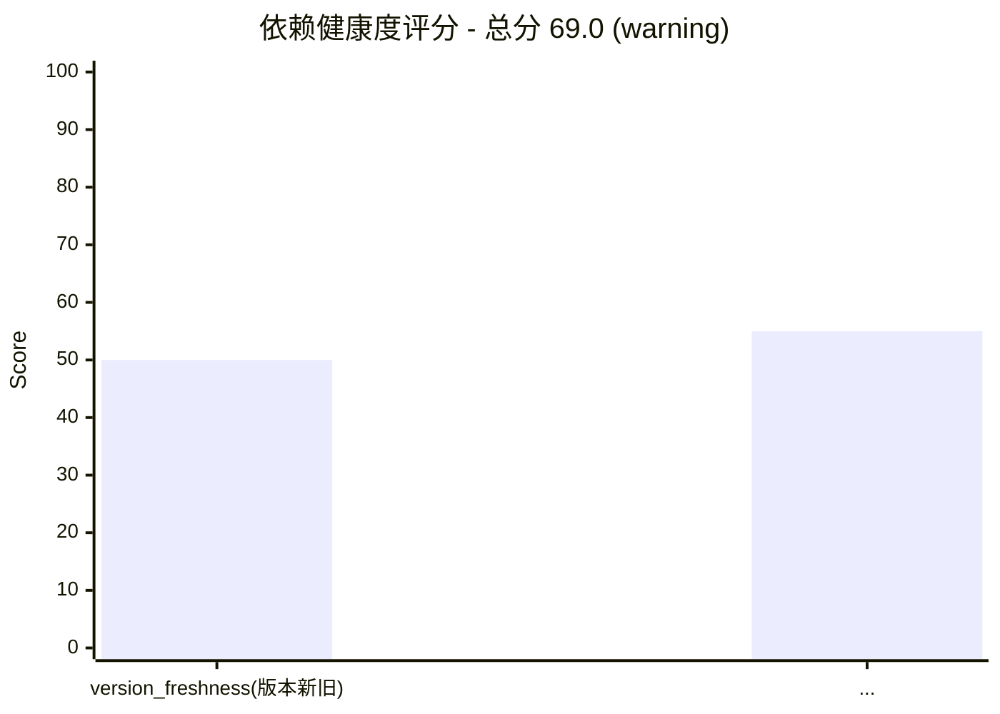

# 输出示例 (Output Examples)

> 各子命令的输出 schema 与示例。命令速查见 [subcommands.md](./subcommands.md)，功能详解见 [subcommands-features.md](./subcommands-features.md)。

## 冲突检测结果

`detect_conflicts` 输出，`display_conflicts` 格式化（`analyze` / `analyze-data` 传 `--conflicts` 时打印）：

```
发现 1 个冲突:
  包: numpy
  类型: version_mismatch
  严重级别: high
  建议: 统一 numpy 的版本约束（按约束字符串比对，语义等价写法可能误报，请人工确认）
```

## 安全漏洞检测结果

`assess_security` 输出，`display_vulnerabilities` 格式化（传 `--security` 时打印），schema 见 `SecurityVulnerability`：

```
发现 1 个安全漏洞:
  CVE: CVE-2023-32681
  包: requests@2.25.0
  严重级别: high
  描述: Unintended leak of Proxy-Authorization header
  修复版本: 2.31.0
```

## deps_data.json schema

`analyze-data` / `report` 子命令的输入（LLM 或外部工具手工整理）：

```json
{
  "packages": [
    {"name": "my-project", "version": "1.0.0", "ecosystem": "pypi", "is_root": true},
    {"name": "requests", "version": "2.28.0", "ecosystem": "pypi", "is_root": false, "license": "Apache-2.0", "version_inferred": false}
  ],
  "edges": [
    {"source": "my-project", "target": "requests", "constraint": ">=2.28.0"}
  ]
}
```

字段说明：

| 字段 | 必填 | 说明 |
|------|------|------|
| `name` | 是 | 包名 |
| `version` | 否 | 版本号。入口会用 `_extract_concrete_version` 归一化：范围串（`^1.2.0`/`>=2.0`）取下界并标 `version_inferred=true`；无法确定（`*`/`latest`/`1.2.x`/区间/排除式）置空串——禁止伪版本原样送 OSV 查询，空版本包在报告 `scan_warnings` 中显式列出 |
| `ecosystem` | 否 | 默认 `pypi`；支持 pypi/npm/maven/crates/rubygems/packagist/nuget |
| `is_root` | 否 | 默认 `false`；根包（项目自身）不出现在许可证合规范围 |
| `license` | 否 | 已知许可证（如来自 lockfile/SBOM）；缺省时由 `enrich_licenses` 查 registry 回填，查不到报告层标 `UNKNOWN` |
| `version_inferred` | 否 | 仅输出语义：`true` 表示 version 是范围约束推断的下界（OSV 受影响判定为保守近似），报告 `scan_warnings` 会汇总计数 |
| `constraint` | 否 | 边上的原始版本约束串，默认 `*` |

## report.json schema

`export_report_json` 输出：

```json
{
  "timestamp": 1730000000.0,
  "root_package": "my-project",
  "summary": {"total_packages": 12, "total_dependencies": 30, "conflicts": 1, "vulnerabilities": 2, "update_paths": 1},
  "conflicts": [{"package": "numpy", "conflict_type": "version_mismatch", "severity": "high", "required_by": [...], "suggestion": "..."}],
  "vulnerabilities": [{"cve_id": "CVE-2023-32681", "package": "requests", "version": "2.25.0", "severity": "high", "fixed_version": "2.31.0"}],
  "update_paths": [{"package": "requests", "current_version": "2.25.0", "target_version": "2.31.0", "steps": [...]}],
  "recommendations": ["发现 1 个依赖冲突，建议统一版本约束"]
}
```

## health 子命令输出

`health_scorer.score_health` 输出：

```
  总分: 69.0/100  等级: WARNING

  5 维度评分:
    版本新旧度        ██████████░░░░░░░░░░  50.0
    漏洞状态         ███████████░░░░░░░░░  55.0
    维护状态         ███████████████░░░░░  75.0
    依赖稳定性        ████████████████████ 100.0
    许可证合规性       ███████████████░░░░░  75.0

  改进建议:
    1. 版本新旧度最低（50.0），建议升级过时依赖到最新稳定版


```

## SBOM 输出

`sbom_generator.generate_sbom` 输出，SPDX 2.3：

```json
{
  "SPDXVersion": "SPDX-2.3",
  "DataLicense": "CC0-1.0",
  "SPDXID": "SPDXRef-DOCUMENT",
  "DocumentName": "my-project",
  "DocumentNamespace": "https://dayv.local/my-project/<uuid>",
  "CreationInfo": {
    "Created": "2024-01-01T00:00:00Z",
    "Creators": ["Tool: dayv-dependency-analyzer-1.0"],
    "LicenseListVersion": "3.21"
  },
  "Packages": [
    {"Name": "requests", "SPDXID": "SPDXRef-Package-requests", "VersionInfo": "2.25.0",
     "DownloadLocation": "https://pypi.org/project/requests", "FilesAnalyzed": false,
     "LicenseConcluded": "NOASSERTION", "Supplier": "NOASSERTION"}
  ],
  "Relationships": [
    {"SPDXElementID": "SPDXRef-DOCUMENT", "RelationshipType": "DESCRIBES", "RelatedSPDXElement": "SPDXRef-Package-my-project"},
    {"SPDXElementID": "SPDXRef-Package-my-project", "RelationshipType": "DEPENDS_ON", "RelatedSPDXElement": "SPDXRef-Package-requests"}
  ]
}
```
