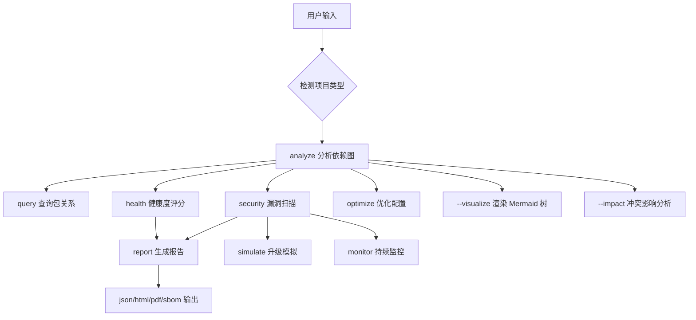

# Subcommands Reference

> 详细子命令用法、Core Features 详解、输出 schema。从 SKILL.md 外移，按需加载。

## 详细文档索引

| 文档 | 内容 |
|------|------|
| [subcommands-features.md](./subcommands-features.md) | Core Features 1-13 详细说明（依赖图/冲突检测/漏洞扫描/健康度/可视化/...） |
| [subcommands-examples.md](./subcommands-examples.md) | 各子命令输出 schema 与示例（冲突/漏洞/report.json/health/SBOM） |
| [subcommands-optimize.md](./subcommands-optimize.md) | optimize 子命令详解（去重/冗余/未使用检测） |

## Quick Start

```bash
# 分析项目依赖（自动检测配置文件类型）
python scripts/dependency_analyzer.py analyze /path/to/project
  # 可选 flag: --conflicts | --recommend | --security | --updates | --report -o <file>

# 查询包的依赖关系（默认 ecosystem=pypi）
python scripts/dependency_analyzer.py query numpy
python scripts/dependency_analyzer.py query react -e npm
python scripts/dependency_analyzer.py query org.springframework.boot:spring-boot -e maven
python scripts/dependency_analyzer.py query serde -e crates
python scripts/dependency_analyzer.py query rails -e rubygems
python scripts/dependency_analyzer.py query monolog/monolog -e packagist
python scripts/dependency_analyzer.py query Newtonsoft.Json -e nuget

# 搜索包
python scripts/dependency_analyzer.py search "web framework"
python scripts/dependency_analyzer.py search "logging" -e npm

# 检查安全漏洞（先查真实最新版本，避免 false positive）
python scripts/dependency_analyzer.py security requests
python scripts/dependency_analyzer.py security requests --priority
  # --priority: 按 CVSS × 0.5 + exploit × 0.3 + business × 0.2 加权排序
  # 输出: 优先级排名 + CVE ID + 包名 + 严重度 + 优先级分 + 修复建议

# 生成完整报告（支持 4 种格式，输入是 deps_data.json 而非项目路径）
python scripts/dependency_analyzer.py report deps_data.json --format json -o report.json
python scripts/dependency_analyzer.py report deps_data.json --format html -o report.html
python scripts/dependency_analyzer.py report deps_data.json --format pdf  -o report.pdf
python scripts/dependency_analyzer.py report deps_data.json --format sbom -o project-sbom.spdx.json
  # deps_data.json schema: {"packages": [{name, version, ecosystem, is_root}], "edges": [{source, target, constraint}]}
  # --format json (默认): 与 export_report_json schema 一致的 JSON 报告
  # --format html: 含可排序表格的 HTML 报告（支持中文，防 XSS）
  # --format pdf:  HTML 转 PDF（依赖 weasyprint，未安装时显式报错）
  # --format sbom: SPDX 2.3 JSON 格式的软件物料清单

# 评估项目依赖健康度（5 维度评分 + 雷达图 + 改进建议）
python scripts/dependency_analyzer.py health /path/to/project
python scripts/dependency_analyzer.py health /path/to/project -o health.json
  # 输出: 总分(0-100) + 5 维度评分 + 改进建议 + Mermaid 雷达图
  # 阈值: >=70 healthy, 50-69 warning, <50 danger
  # 维度: 版本新旧(0.2) / 漏洞状态(0.3) / 维护状态(0.15) / 依赖稳定(0.2) / 许可证合规(0.15)

# 渲染 Mermaid 依赖树（可视化依赖关系）
python scripts/dependency_analyzer.py analyze /path/to/project --visualize
python scripts/dependency_analyzer.py analyze /path/to/project --visualize --depth 5 -o tree.mmd
  # 输出: ```mermaid flowchart TD``` 代码块（可在 markdown 渲染）
  # 节点: P0["name@version"] / 边: P0 --> P1
  # --depth N: 控制渲染层级（默认 3，从根出发的依赖层数）
  # 循环依赖: 标注 %% CIRCULAR DETECTED 并停止该分支

# 冲突影响范围分析（反向追溯受影响包 + 依赖链）
python scripts/dependency_analyzer.py analyze /path/to/project --impact
python scripts/dependency_analyzer.py analyze /path/to/project --impact -o impact.json
  # 输出: 每个冲突的 conflict_package + required_versions + affected_packages + dependency_chains
  # BFS 反向追溯: 从冲突包出发找所有依赖它的包
  # 依赖链: 从根到冲突包的所有路径（DFS 带环检测）

# 生成项目依赖 README 章节（markdown 表格）
python scripts/dependency_analyzer.py readme /path/to/project
python scripts/dependency_analyzer.py readme /path/to/project -o DEPS.md
  # 输出: ## 依赖说明 章节，按 ecosystem 分组（PyPI/npm/Maven/...）
  # 每组一个 markdown 表格: 包名 | 版本 | 用途 | 许可证
  # 用途/许可证通过 subprocess 调 ecosystem 脚本（pypi.py/npm.py/...）查询
  # 查询失败时显示占位符 "-"，不崩溃

# 升级影响模拟（dry-run，不实际升级）
python scripts/dependency_analyzer.py simulate requests 2.31.0
python scripts/dependency_analyzer.py simulate requests 2.31.0 --project /path/to/project
python scripts/dependency_analyzer.py simulate react 18.0.0 --project /path/to/project -o sim.json
  # 输出: 风险等级 + 新增/移除依赖 + 冲突 + 回滚建议
  # 风险等级: major 升级=high / minor=medium / patch=low / 降级=high
  # --project: 分析现有依赖图（无则仅基于版本号判定风险）
  # 回滚建议按 ecosystem 生成（pypi: git checkout requirements.txt / npm: git checkout package.json）

# 漏洞持续监控（定时扫描 + 告警 + 历史对比）
python scripts/dependency_analyzer.py monitor /path/to/project
python scripts/dependency_analyzer.py monitor /path/to/project --cron "0 9 * * *"
python scripts/dependency_analyzer.py monitor /path/to/project --webhook https://hooks.example.com/dayv
  # 输出: 扫描结果 + 与历史对比的新增漏洞 + 告警文本
  # --cron: 生成 crontab 条目字符串（不实际安装，需手动 crontab -e）
  # --webhook: 检测到新漏洞时 POST JSON 告警到 webhook
  # 历史文件: ~/.dayv/monitor_history.json（保留最近 50 次扫描）
  # 告警格式: [DAYV ALERT] 检测到 N 个新漏洞 + CVE 列表

# 依赖配置优化（去重 + 删冗余 + 识别未使用）
python scripts/dependency_analyzer.py optimize /path/to/project
  # 详见 subcommands-optimize.md
```

## 子命令流程概览


